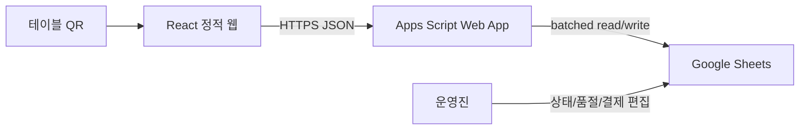
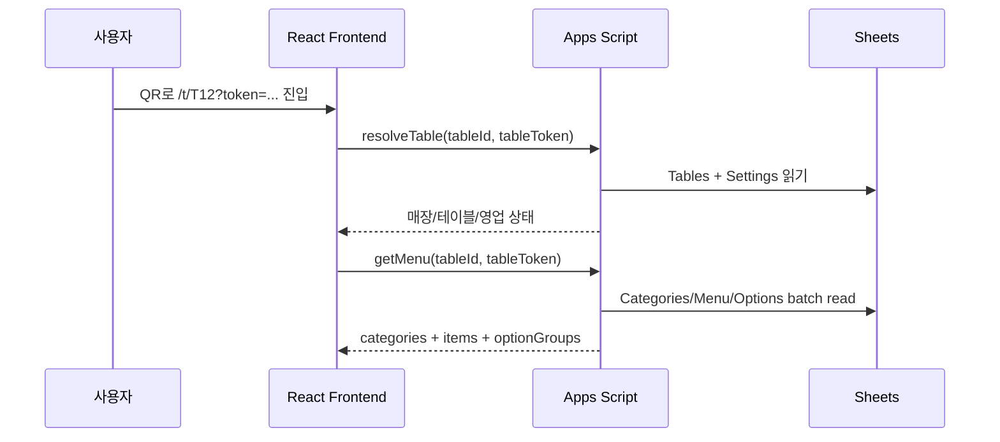
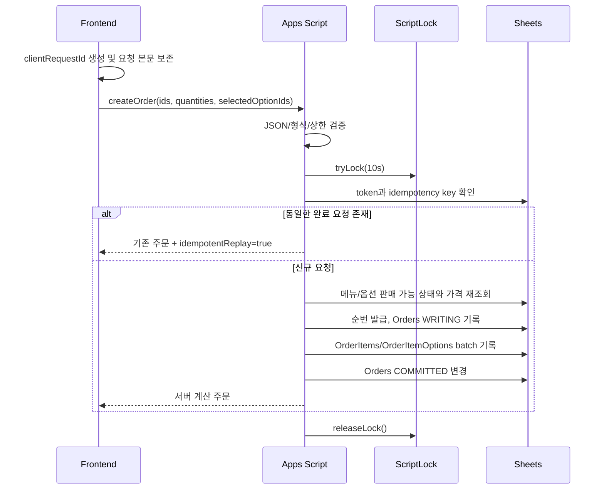
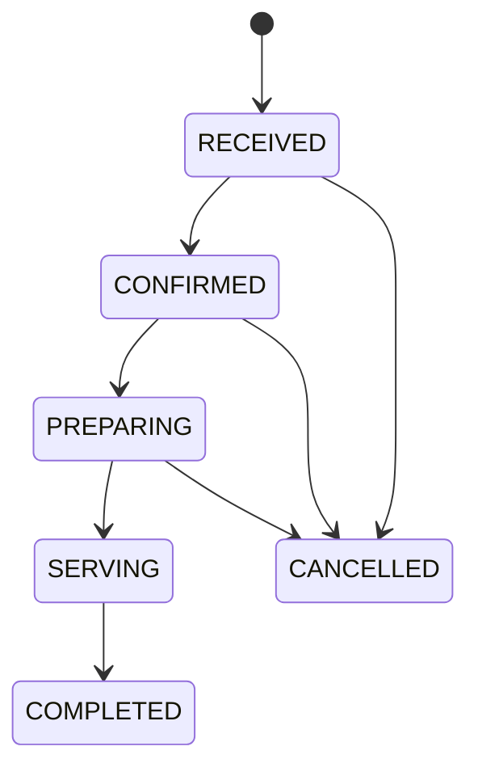

# QR 주문 백엔드 아키텍처

> 상태: 구현 기준안
>
> 작성일: 2026-08-25
>
> 범위: Google Sheets + Google Apps Script 기반 MVP 백엔드 설계. 프론트엔드와 Figma는 수정하지 않는다.

## 1. 목표와 근거

이 시스템은 대학 학생회가 하루 동안 운영하는 일일호프에서 테이블별 QR 주문을 받는다. 우선순위는 행사 당일 안정성, 운영진의 복구 용이성, 중복 주문과 가격 조작 방지, 빠른 구현 순이다.

설계 근거의 우선순위는 다음과 같다.

1. Figma `ui-ux` 파일의 `Screens — Primary Flow` 노드 `4:11`
2. 저장소 루트의 `UX-STRUCTURE.md`
3. 현재 React/Vite 프론트엔드의 타입과 라우팅
4. 이 문서 세트의 백엔드 결정

Figma MCP로 `4:11`을 조회해 다음 실제 프레임을 확인했다.

| 화면 | Figma node | 핵심 표시 데이터 |
|---|---|---|
| S01 Table Confirmation | `14:2` | 매장명, 영업 상태, 테이블 번호, 안내 문구 |
| S02 Menu Browsing | `14:15` | 카테고리, 메뉴명, 설명, 가격, 품절, 이미지, 장바구니 합계 |
| S04 Menu Detail | `15:39` | 메뉴 상세, 알레르기, 원산지, 필수/선택 옵션, 옵션 가격·품절, 수량 |
| S05 Cart | `15:95` | 선택 옵션, 수량, 행별 금액, 총액 |
| S06 Order Confirmation | `16:80` | 테이블, 주문 요약, 총액, 후불 안내 |
| S07 Order Complete | `16:106` | 테이블, 서버 확정 총액, 주문번호 `A-1042` 형식 |
| S08 Order Status | `16:121` | 공개 상태 4단계, 회차별 주문·시각·항목, 누적 합계 |

Figma 파일은 S08에서 끝난다. S00, S02b, T1, D1-D3, B1-B2, E1-E5의 실제 프레임은 없으므로 이들을 Figma 요구사항으로 간주하지 않는다. 다만 `UX-STRUCTURE.md`에 정의된 오류와 복구 상태는 API 오류 계약에 반영한다.

## 2. 주요 결정

### Decision A1 — 프론트엔드와 Apps Script는 분리 배포한다

현재 프론트엔드는 Vite와 `BrowserRouter`를 사용하는 독립 React 앱이며 Netlify에 배포한다. Apps Script HTMLService iframe 안에서 실행하도록 바꾸면 라우팅 방식, 빌드 산출물 주입, 배포 방식이 함께 바뀐다. 따라서 MVP의 기본 구조는 다음과 같다.



Apps Script는 `doGet(e)`/`doPost(e)`와 ContentService JSON으로 API 역할만 한다. `google.script.run`은 HTMLService 내부 페이지에서만 사용할 수 있으므로 현재 구조에는 사용하지 않는다. Apps Script 웹 앱은 `doGet`/`doPost`와 `TextOutput`으로 배포할 수 있고, `/exec` 뒤의 경로는 `e.pathInfo`로 전달된다. 자세한 전송 결정은 [apps-script-api-design.md](./apps-script-api-design.md)에 있다.

정적 호스팅 위치와 브라우저 CORS 동작은 구현 시작 시 반드시 스파이크한다. Apps Script ContentService가 응답을 일회성 `script.googleusercontent.com` URL로 리다이렉트한다는 점은 [공식 문서](https://developers.google.com/apps-script/guides/content)에 명시돼 있지만, 임의 응답 헤더를 설정하는 API는 제공하지 않는다.

### Decision A2 — QR의 `tableToken`을 MVP의 세션 스코프 토큰으로도 사용한다

QR URL은 다음 형식을 기준으로 한다.

```text
https://{frontend-origin}/t/T12?token={128-bit-or-more-random-token}
```

프론트엔드는 `/t/:tableId?token=...` 경로에서 `tableId`와 `tableToken`을 분리해 복구한다. S01에서 사람이 읽을 수 있는 테이블 번호를 즉시 확인할 수 있고, 서버는 두 값의 조합을 검증한다.

별도 로그인이나 서버 저장 세션은 만들지 않는다. 원본 토큰은 QR과 사용자 브라우저에만 있고, Sheet에는 `SHA-256(secretPepper + ":" + tableToken)`만 저장한다. `secretPepper`는 Script Properties에 둔다. 이 토큰은 현재 프론트엔드의 `TableSession.token` 및 `localStorage` 스코프 키로 사용한다.

### Decision A3 — 내부 UUID와 현장용 순번을 분리한다

- `order_id`: `Utilities.getUuid()`로 생성하는 내부 불변 ID
- `display_number`: Script Lock 안에서 발급하는 정수 순번
- `display_code`: Settings의 접두사와 순번을 결합한 `A-1042` 형식

Figma와 현재 프론트 타입이 `A-1042`를 사용하므로 이를 기본값으로 한다. 순번에 공백이 생기는 것은 허용하지만 중복은 허용하지 않는다. 내부 참조와 고객 응대용 번호를 분리하면 현장 가독성과 데이터 안정성을 동시에 얻는다.

### Decision A4 — 주문 시점의 이름과 가격을 모두 snapshot으로 저장한다

클라이언트는 ID, 수량, 선택 옵션 ID만 보낸다. 서버는 Sheet의 현재 판매 가능 상태와 가격으로 계산하고 다음 값을 주문에 복사한다.

- 메뉴명, 기본 가격, 옵션 그룹명, 옵션명, 옵션 가격 증감
- 옵션 포함 단가, 수량, 행 합계, 주문 총액

이후 운영진이 메뉴명이나 가격을 바꿔도 과거 주문 내역과 매출은 바뀌지 않는다.

### Decision A5 — 고객 공개 상태와 운영 상태를 분리한다

운영진은 6개 상태를 사용하고, Figma의 네 칩에는 이를 축약해 노출한다.

| 운영 상태 | 의미 | 고객 API `publicStatus` | Figma 레이블 |
|---|---|---|---|
| `RECEIVED` | 서버가 주문을 기록했으나 운영진 미확인 | `accepted` | 접수됨 |
| `CONFIRMED` | 운영진이 주문을 수락 | `accepted` | 접수됨 |
| `PREPARING` | 주방 조리 중 | `preparing` | 조리 중 |
| `SERVING` | 서빙 담당 인계 및 테이블 전달 단계 | `served` | 서빙 완료 |
| `COMPLETED` | 서빙까지 끝난 주문의 최종 종료 | `closed` | 완료 |
| `CANCELLED` | 취소됨 | `cancelled` | 정상 트래커 대신 취소 안내 |

`SERVING`이라는 내부 이름은 “서빙 대상/서빙 처리 단계”를 뜻한다. Figma의 `서빙 완료`로 보이게 하려면 운영진은 실제 전달 후에만 이 값으로 바꿔야 한다. `COMPLETED`는 서빙까지 끝난 주문을 최종 종료한 상태이며 결제 완료를 뜻하지 않는다. 후불 결제는 별도의 `payment_status`로 관리한다.

## 3. 요청 흐름

### 3.1 QR 진입과 메뉴



S01은 테이블과 영업 상태 확인 전에는 메뉴로 진행시키지 않는다. 메뉴 조회도 토큰을 다시 검증해, URL이나 localStorage의 테이블 ID만 바꾸어 다른 테이블 컨텍스트를 만들 수 없게 한다.

### 3.2 주문 생성



프론트엔드의 장바구니 가격은 표시용이다. S06의 주문 확정 버튼을 누른 순간 서버가 다시 계산한 값만 S07에 사용한다. 네트워크 타임아웃 후 재시도할 때 프론트엔드는 새 UUID를 만들지 않고 동일한 `clientRequestId`와 본문을 재전송한다.

## 4. Figma 화면과 백엔드 매핑

| Figma 화면/컴포넌트 | 필요한 데이터 | API action | 원본 Sheet | 비고 |
|---|---|---|---|---|
| S01 매장명/영업 칩 | `storeName`, `eventOpen` | `resolveTable` | Settings | 이벤트 전체 영업 상태 |
| S01 TableChip/안내 | `tableId`, `displayName`, `notice` | `resolveTable` | Tables, Settings | token 검증 성공 후만 노출 |
| S02 카테고리 탭 | id, label, heading, 순서 | `getMenu` | Categories | 활성 카테고리만 |
| S02 메뉴 행 | name, description, price, imageUrl, available | `getMenu` | Menu | 품절도 목록에는 남기고 비활성 표시 |
| S02 BottomOrderBar | 장바구니 수량·합계 | 없음 | - | 클라이언트 상태, 최종 가격 아님 |
| S04 메뉴 상세 | allergens, origin, basePrice | `getMenu` | Menu | 동일 응답을 상세 화면에서 재사용 가능 |
| S04 옵션 그룹 | required, selectionType, min/max, options | `getMenu` | MenuOptionGroups, MenuOptions | 옵션별 `available`, `priceDelta` 포함 |
| S05 장바구니 | 선택 ID, 수량, 표시 단가 | 없음 | - | localStorage; 서버 데이터가 바뀌면 주문 시 거절 가능 |
| S06 확인 | 테이블, 읽기 전용 주문 요약 | `resolveTable` 결과 + client state | - | 확정 클릭 시 `createOrder` |
| S07 완료 | table, displayCode, totalAmount, status | `createOrder` | Orders | 반드시 서버 응답 금액 사용 |
| S08 StatusTracker | latest `publicStatus` | `listOrders` | Orders | 15초 polling, 실패 시 마지막 값 유지 |
| S08 회차 카드 | displayCode, createdAt, item snapshots | `listOrders` | Orders, OrderItems, OrderItemOptions | 최신 회차부터 표시 |
| S08 누적 합계 | `sessionTotalAmount` | `listOrders` | Orders | `COMMITTED`, 비취소 주문 합계 |
| S08 직원 호출 | 현재 Figma에는 버튼만 존재 | 미정 | - | B1 프레임/운영 방식 결정 전 API를 만들지 않음 |

Figma의 S05에는 테이블 번호가 실제로 그려져 있지 않지만 `UX-STRUCTURE.md` §6.1은 S05에도 표시하도록 요구한다. 프론트엔드가 Figma를 우선하는 현재 규칙에 따라 백엔드는 추가 필드를 만들지 않고 이미 해석한 테이블 정보를 유지한다.

## 5. 주문 상태와 전이 규칙



규칙은 다음과 같다.

- 정상 전이는 정확히 한 단계씩만 진행한다. 운영 복구가 필요하면 관리자 함수가 명시적인 사유와 AuditLog를 남기고 예외 전이를 수행한다.
- 고객은 주문을 취소할 수 없다. `RECEIVED`, `CONFIRMED`, `PREPARING`의 취소는 운영진만 수행한다.
- `SERVING` 이후 일반 취소는 막는다. 오배송·환불은 원 주문을 보존하고 `payment_status`와 AuditLog로 보정한다.
- `CANCELLED`, `COMPLETED`는 terminal이다.
- 상태를 바꿀 때 `updated_at`, `status_updated_at` 및 해당 단계 timestamp를 함께 기록한다.
- 직접 Sheet 편집 시 데이터 검증 dropdown과 설치형 edit trigger 가드를 사용한다. 단순 `onEdit`은 최대 두 이벤트만 queue한다는 [공식 제약](https://developers.google.com/apps-script/guides/triggers#restrictions)이 있으므로 사용하지 않는다. 대량 붙여넣기는 금지하고, 예외 복구는 커스텀 메뉴 함수로 수행한다.

## 6. 테이블 QR 보안

### 방어하는 것

- 존재하지 않는 `tableId`: `INVALID_TABLE`
- `tableId`만 다른 값으로 바꾼 요청: 해당 테이블의 token hash와 불일치하므로 `INVALID_TABLE_TOKEN`
- 비활성 테이블: 조회/신규 주문을 `INACTIVE_TABLE`로 차단
- 유출된 Sheet에서 QR 원본 토큰 확인: pepper를 포함한 hash만 저장하므로 바로 재사용하기 어려움
- 버튼 중복 클릭과 네트워크 재전송: `clientRequestId` idempotency
- 가격/옵션 가격 조작: ID만 받고 서버에서 재계산

### 방어하지 못하는 것

- QR 사진이나 전체 URL을 공유받은 사람은 같은 capability를 가진다.
- 사용자의 실제 위치, 신원, 테이블 착석 여부를 증명하지 않는다.
- 브라우저 악성 코드나 화면을 직접 조작하는 행위를 막지 못한다. 서버 검증으로 영향만 제한한다.
- 서비스 거부 공격에 대한 전문 방어가 아니다. Apps Script 앞단에서 IP나 WAF 규칙을 세밀하게 제어할 수 없다.

현실적인 보완은 S01/S06/S07에서 테이블 번호를 반복 표시하고, 유출 시 해당 테이블 토큰을 교체해 QR을 재출력하며, 테이블당 비정상 주문 burst를 AuditLog로 확인하는 것이다.

## 7. 동시성 및 데이터 원자성

Apps Script의 `getScriptLock()`은 사용자와 무관하게 동일 스크립트의 보호 구간을 한 실행만 통과시키므로 주문 쓰기에 사용한다. 이는 공유 자원 충돌 방지를 위한 공식 API다. 자세한 동작은 [LockService 문서](https://developers.google.com/apps-script/reference/lock/lock-service)를 따른다.

Lock 안에서만 수행할 작업:

1. 유효한 token인지 확인
2. `(table_id, client_request_id)` 기존 주문 확인
3. 주문 생성용 메뉴·옵션을 Sheet에서 직접 재조회하고 검증
4. display number 할당
5. Orders/OrderItems/OrderItemOptions batch write
6. Orders `write_state=COMMITTED` 전환

Lock 밖에서 수행할 작업:

- JSON parsing과 형식/개수 상한 검증
- 응답 JSON 직렬화
- 읽기 전용 메뉴/주문 조회
- 로깅 포맷 생성, 캐시 갱신, UI 포맷팅

Google Sheets는 여러 Sheet에 대한 트랜잭션을 제공하지 않는다. 그래서 Orders에 `write_state`를 둔다.

- `WRITING`: 헤더는 생겼지만 자식 행 기록 중
- `COMMITTED`: API와 운영 View에 노출 가능
- `FAILED`: 부분 실패. 동일 idempotency 요청이 deterministic child ID로 누락 행을 보충한 뒤 commit할 수 있음

이 방식은 RDB transaction과 동일하지 않지만, 운영진이 불완전 주문을 식별하고 재처리할 수 있게 한다. 모든 read API와 통계는 `write_state=COMMITTED`만 사용한다.

## 8. 품절과 가격 변경

- 운영진은 Menu 또는 MenuOptions의 `available`을 `FALSE`로 바꾼다.
- 신규 메뉴 조회는 Sheet를 batch read해 즉시 반영한다. MVP에서는 “즉시” 요구 때문에 메뉴 응답을 cache하지 않는다.
- 주문 생성은 항상 cache를 우회하고 lock 안에서 해당 메뉴와 옵션을 다시 읽는다.
- 사용자가 S04를 보고 있는 동안 품절돼도 createOrder가 `MENU_SOLD_OUT` 또는 `OPTION_SOLD_OUT`으로 거절한다.
- 주문이 먼저 `COMMITTED`된 뒤 운영진이 품절로 바꾼 경우 그 주문은 유효하다.

단, 사람이 셀을 직접 바꾸는 작업은 `LockService`에 참여하지 않는다. 주문 실행이 `available=TRUE`를 읽은 직후 운영진이 셀을 FALSE로 바꾸면 마지막 한 건이 접수될 수 있다. 엄격한 순서를 원하면 운영진은 행을 선택하고 Sheet 커스텀 메뉴의 “메뉴 품절/판매 재개”를 사용한다. 이 함수가 주문 생성과 같은 Script Lock을 획득해 값을 변경한다. 행사 규모의 fallback으로 직접 편집을 허용한다면 이 한 건 race를 운영 정책으로 수용하고, 주문 접수 시각과 품절 변경 AuditLog를 비교한다.

향후 메뉴 조회가 병목이면 `CacheService.getScriptCache()`와 menu version을 도입할 수 있다. 캐시는 값이 없을 수 있는 최적화일 뿐 진실의 원본으로 사용하지 않는다. Google도 서비스 호출을 줄이고 batch I/O와 CacheService를 쓰도록 [권장](https://developers.google.com/apps-script/guides/support/best-practices)한다.

## 9. 운영, 모니터링, 복구

운영진은 canonical Sheet를 직접 수정하되 다음 원칙을 지킨다.

- Tables/Menu/Options의 ID 열과 주문 snapshot 열은 보호 범위로 설정한다.
- 운영진이 주로 수정하는 열은 `available`, `active`, Orders의 `status`, `payment_status`다.
- Orders status에는 enum dropdown을 적용한다.
- 상태별 운영 화면은 canonical 데이터를 복제하지 않고 Filter View 또는 QUERY 전용 View Sheet로 만든다.
- `WRITING`이 30초 이상 지속되거나 `FAILED`인 주문은 빨간 조건부 서식으로 표시한다.
- Apps Script 실행 기록과 AuditLogs를 함께 확인한다.
- 행사 시작 전 Spreadsheet와 Apps Script의 소유자는 개인 계정 한 명에 의존하지 않도록 학생회 관리 계정/공유 Drive 정책을 확정한다.

복구 순서:

1. 주문 API 장애 시 프론트는 동일 `clientRequestId`로 제한된 횟수만 재시도한다.
2. 운영진은 `FAILED/WRITING` View를 확인한다.
3. “실패 주문 복구” 관리자 함수를 실행해 deterministic item ID 기준으로 누락 행을 upsert한다.
4. 복구 불가하면 원 행은 삭제하지 않고 `FAILED`와 AuditLog를 남긴 뒤 현장 수기 주문으로 전환한다.
5. 행사를 마친 뒤 Sheet 사본을 날짜 이름으로 보관한다.

## 10. Apps Script/Sheets 한계와 이전 기준

Apps Script의 quota와 제한은 계정 유형에 따라 달라지고 예고 없이 변경될 수 있다. 2026-08-25 기준 공식 표에는 실행당 6분, 사용자당 동시 실행 30개, 스크립트당 동시 실행 1,000개가 안내돼 있다. 실제 값은 구현/행사 전 [공식 quota 문서](https://developers.google.com/apps-script/guides/services/quotas)에서 다시 확인한다.

주요 리스크:

- 주문 write는 하나의 Script Lock을 통과하므로 순간 burst에서 대기 시간이 늘어난다.
- Spreadsheet 호출 latency와 일시적 Google 서비스 오류가 있다.
- 15초 polling을 모든 탭이 계속 수행하면 read traffic이 커진다.
- 여러 Sheet 쓰기는 진짜 transaction이 아니다.
- 수식과 대규모 데이터가 늘면 Spreadsheet 자체가 느려진다.
- ContentService redirect/CORS와 배포 버전 관리가 일반 API 서버보다 제약이 크다.

이 설계가 적합한 경험적 범위는 한 행사, 수십 개 테이블, 수백 건 주문, 초당 1~2건 정도의 짧은 주문 생성 burst다. 아래 중 하나가 필요해지면 Firebase/Supabase 같은 트랜잭션 DB/API로 이전한다.

- 초당 3~5건 이상의 주문 write가 지속되거나 lock timeout이 관측됨
- 수백 대 기기의 지속 polling 또는 준실시간 push가 필요함
- 재고 차감, 온라인 결제, 환불처럼 강한 transaction이 필요함
- 여러 행사/매장을 장기 운영하고 권한별 관리자 계정이 필요함
- 주문 수정 이력, SLA, 자동 장애 조치가 중요해짐

이는 Google의 공식 성능 보장이 아니라 MVP 운영을 위한 보수적 기준이다. 행사 전 실제 기기와 목표 동시성으로 load test해 조정한다.

## 11. Open Questions

1. **Netlify와 CORS**: 프론트 호스팅은 Netlify로 확정했다. Apps Script 배포 URL을 대상으로 실제 브라우저 `fetch` GET/POST/redirect 테스트를 먼저 통과해야 한다. 실패하면 Netlify Function proxy 또는 HTMLService + 라우터 변경 중 하나를 선택한다.
2. **직원 호출**: S08에 버튼은 있으나 B1 프레임과 운영 수신 방식이 없다. 호출 API/Sheet는 요구사항이 확정될 때 별도 추가한다.
3. **주방 요청 메모**: `UX-STRUCTURE.md`는 S05 note를 정의하지만 현재 Figma S05에는 보이지 않는다. API/Orders에는 optional `note`를 예약하되 프론트가 보내기 전까지 사용하지 않는다.

확정된 QR 형식은 `https://{netlify-domain}/t/{tableId}?token={random-token}`이다. `COMPLETED`는 결제와 무관하게 서빙까지 끝난 주문의 최종 완료를 뜻한다.

## 12. 구현 권장 순서

1. [google-sheets-schema.md](./google-sheets-schema.md)의 header와 data validation을 생성하는 setup 함수 작성
2. table token 발급/hash/검증과 `resolveTable` 구현
3. catalog batch read와 `getMenu` 구현, 옵션 계약을 프론트 타입과 맞춤
4. idempotency, Script Lock, snapshot write를 포함한 `createOrder` 구현
5. `getOrder`/`listOrders`와 15초 polling 연동
6. 상태 dropdown, 설치형 edit trigger guard, 운영 Filter View/QUERY Sheet 구성
7. 동시 주문, 재전송, 품절 race, 부분 write 실패 테스트
8. 실제 배포 URL로 모바일 브라우저/CORS/load smoke test 후 QR 출력

## 13. 완료 검토 결과

| 검토 항목 | 설계 결과 |
|---|---|
| Figma 주문 화면의 데이터가 API에 포함되는가 | S01/S02/S04-S08 mapping을 작성했고, 옵션·snapshot·회차·누적 합계를 계약에 포함했다. |
| 클라이언트 가격 조작을 막는가 | create request에 가격 field를 허용하지 않고 Menu/MenuOptions 현재 값으로 서버 계산한다. |
| 중복 클릭이 주문 한 건만 만드는가 | `(table_id, client_request_id)` unique key, fingerprint, Script Lock, replay response를 사용한다. |
| 동시 주문의 번호/행 충돌을 막는가 | 내부 UUID와 Lock 안의 display counter, deterministic child ID, batch write를 사용한다. |
| 주문 직전 품절을 막는가 | createOrder가 cache를 우회하고 Lock 안에서 메뉴·옵션 `available`을 다시 읽는다. |
| table 값 변경 공격을 막는가 | table별 raw random token의 peppered hash를 비교하며 ID와 token이 함께 일치해야 한다. |
| 운영진이 Sheet만으로 관리 가능한가 | status/payment dropdown, 설치형 edit guard, 상태별 QUERY View와 복구 View를 정의했다. |
| 문서만으로 구현을 시작할 수 있는가 | 정확한 header, enum, request/response, error, 파일 책임, 핵심 V8 함수와 테스트 행렬을 포함했다. |
