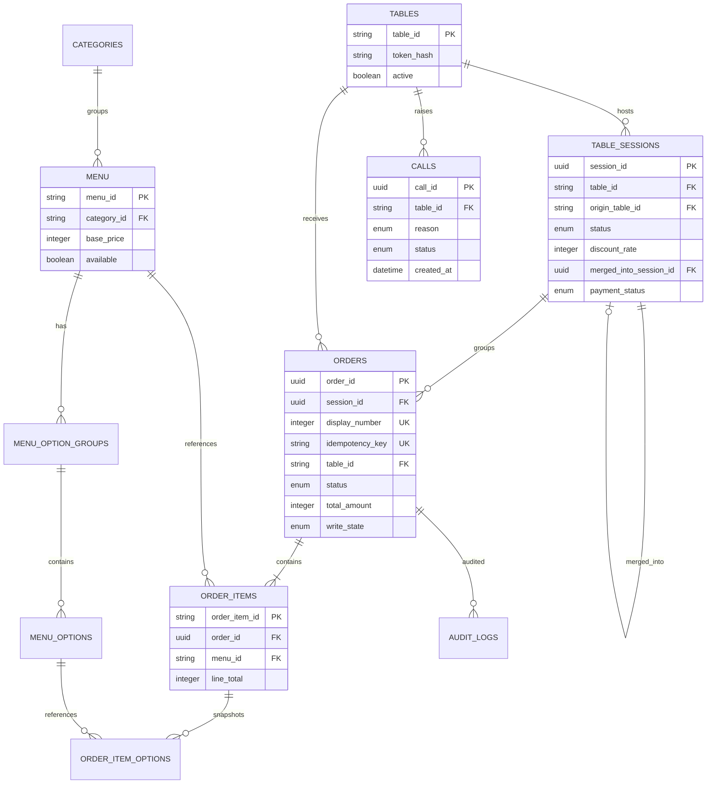

# Google Sheets 데이터 스키마

> 이 문서는 Sheet header, 타입, 제약, 관계와 운영 방식을 정의한다. API는 header 이름으로 열을 찾으며 열 번호를 하드코딩하지 않는다.

## 1. 공통 규칙

- Sheet 이름과 header는 이 문서의 대소문자 및 `snake_case`를 그대로 사용한다.
- 1행은 header, 2행부터 데이터다. 중간 빈 행과 병합 셀은 금지한다.
- ID는 문자열로 저장하고 숫자 자동 변환을 피하기 위해 열 서식을 Plain text로 지정한다.
- 금액은 원 단위 정수다. 소수점과 통화 기호를 셀 값에 넣지 않는다.
- boolean은 실제 Sheet boolean `TRUE/FALSE`를 쓴다.
- timestamp는 실제 Date 값으로 저장하고 표시 형식은 `yyyy-mm-dd hh:mm:ss`로 통일한다. Apps Script/API에서는 ISO 8601로 변환한다.
- 모든 API read는 `write_state=COMMITTED`인 주문만 반환한다.
- `unique`는 Sheets가 강제하지 못하므로 setup 검증과 Apps Script repository가 강제한다.
- canonical Sheet에 수식을 넣지 않는다. 수식은 `View_*` Sheet에만 둔다.
- `token_hash`, `request_fingerprint` 열은 보호한다. 원본 table token과 pepper는 Sheet에 저장하지 않는다.

## 2. Sheet 목록

| Sheet | 역할 | 주 변경 주체 |
|---|---|---|
| Tables | 테이블과 QR token hash | 개발자/총괄 운영진 |
| Categories | 메뉴 탭과 섹션 순서 | 운영진 |
| Menu | 메뉴 기본 정보와 판매 가능 상태 | 운영진 |
| MenuOptionGroups | 메뉴 옵션 선택 규칙 | 개발자/운영진 |
| MenuOptions | 옵션명, 가격 증감, 품절 | 운영진 |
| TableSessions | 테이블 방문 단위. 할인·이동·합석·분리·결제의 기준 | Apps Script; 할인/결제만 운영진 |
| Orders | 주문 header, 상태, 결제, idempotency | Apps Script; 상태/결제만 운영진 |
| OrderItems | 주문 당시 메뉴 snapshot | Apps Script 전용 |
| OrderItemOptions | 주문 당시 선택 옵션 snapshot | Apps Script 전용 |
| Calls | 직원 호출 접수와 확인 | Apps Script; 확인만 운영진 |
| Settings | 행사 단위 설정과 순번 counter | 운영진; counter는 Apps Script |
| StaffMembers | 학생회 명단과 서비스 지급 부담금 정산 상태 | 운영진(명단); Apps Script(정산) |
| AuditLogs | 상태 변경과 오류 기록 | Apps Script 전용 |

Figma S04의 필수/복수 옵션 및 옵션별 품절을 표현하려면 MenuOptionGroups/MenuOptions가 필요하다. 과거 주문을 정확히 표시하려면 OrderItemOptions도 필요하다. Categories와 Settings는 운영진이 코드 수정 없이 탭/매장 정보를 관리하게 하는 최소 확장이다.

## 3. 관계



## 4. Tables

| column | type | 필수 | 예시 | unique | index처럼 사용 | 변경 주체 | 설명 |
|---|---|---:|---|---:|---:|---|---|
| `table_id` | string | Y | `T12` | Y | Y | 개발자 | API와 QR의 안정적인 식별자 |
| `display_name` | string | Y | `테이블 12` | N | N | 운영진 | Figma TableChip 표시값 |
| `token_hash` | hex string | Y | `9f3a...` | Y | Y | setup/token rotate 함수 | `SHA-256(pepper + ":" + rawToken)` |
| `token_version` | integer | Y | `1` | N | N | token rotate 함수 | QR 교체/폐기 추적 |
| `active` | boolean | Y | `TRUE` | N | Y | 운영진 | FALSE면 신규 접근/주문 차단 |
| `sort_order` | integer | Y | `12` | N | N | 운영진 | 운영 화면 정렬 |
| `created_at` | datetime | Y | `2026-08-25 15:00:00` | N | N | Apps Script | 생성 시각 |
| `updated_at` | datetime | Y | `2026-08-25 18:30:00` | N | N | Apps Script | 마지막 변경 시각 |

인덱스 map: `byTableId`, `byTokenHash`. `table_id`와 `token_hash`는 각각 중복 불가다.

Sample:

| table_id | display_name | token_hash | token_version | active | sort_order | created_at | updated_at |
|---|---|---|---:|---|---:|---|---|
| T12 | 테이블 12 | `9f3a…` | 1 | TRUE | 12 | 2026-08-25 15:00:00 | 2026-08-25 15:00:00 |

## 5. Categories

| column | type | 필수 | 예시 | unique | index | 변경 주체 | 설명 |
|---|---|---:|---|---:|---:|---|---|
| `category_id` | string | Y | `recommended` | Y | Y | 개발자/운영진 | API category id |
| `label` | string | Y | `추천` | N | N | 운영진 | Figma 탭 레이블 |
| `heading` | string | Y | `추천 메뉴` | N | N | 운영진 | 목록 섹션 제목 |
| `sort_order` | integer | Y | `10` | N | Y | 운영진 | 오름차순 정렬 |
| `active` | boolean | Y | `TRUE` | N | Y | 운영진 | 비활성 category와 소속 메뉴는 API에서 제외 |
| `updated_at` | datetime | Y | `2026-08-25 15:00:00` | N | N | Apps Script/운영진 | 변경 시각 |

초기 seed는 행사 메뉴 구분에 맞춰 `main`, `side`, `alcohol`, `beverage`를 사용한다.

## 6. Menu

| column | type | 필수 | 예시 | unique | index | 변경 주체 | 설명 |
|---|---|---:|---|---:|---:|---|---|
| `menu_id` | string | Y | `kimchi-jjigae` | Y | Y | 개발자 | 메뉴 불변 ID |
| `category_id` | string FK | Y | `recommended` | N | Y | 운영진 | Categories 참조 |
| `name` | string | Y | `김치찌개` | N | N | 운영진 | 표시명 |
| `description` | string | Y | `돼지고기와 묵은지를...` | N | N | 운영진 | 목록/상세 설명 |
| `base_price` | integer >= 0 | Y | `9000` | N | N | 운영진 | 옵션 전 기본 가격 |
| `image_url` | URL/string | N | `https://.../kimchi.jpg` | N | N | 운영진 | 빈 값이면 placeholder |
| `available` | boolean | Y | `TRUE` | N | Y | 운영진 | FALSE면 품절. 목록에는 반환하되 주문 차단 |
| `min_quantity` | integer >= 1 | Y | `1` | N | N | 운영진 | 한 주문 line의 최소 수량 |
| `max_quantity` | integer >= min | Y | `10` | N | N | 운영진 | line별 최대 수량 |
| `allergens` | string | N | `대두|밀` | N | N | 운영진 | `|`로 구분, API는 배열로 변환 |
| `origin` | string | N | `국내산` | N | N | 운영진 | 원산지 표시 |
| `badge_tags` | string | N | `인기|매움` | N | N | 운영진 | 향후 tag badge용. Figma 현재 화면에는 필수 아님 |
| `sort_order` | integer | Y | `10` | N | Y | 운영진 | category 안 정렬 |
| `updated_at` | datetime | Y | `2026-08-25 18:10:00` | N | N | Apps Script/운영진 | 변경 시각 |

무결성:

- `category_id`가 존재하고 활성 상태여야 API에 노출된다.
- `base_price`, `min_quantity`, `max_quantity`가 숫자가 아니면 해당 메뉴를 API에서 제외하고 AuditLog를 남긴다.
- 이미 주문된 메뉴 행을 삭제하지 않는다. 더 이상 판매하지 않으면 `available=FALSE`로 둔다.
- `menu_id`는 이름 변경과 무관하게 유지한다.

Sample:

| menu_id | category_id | name | description | base_price | image_url | available | min_quantity | max_quantity | allergens | origin | badge_tags | sort_order | updated_at |
|---|---|---|---|---:|---|---|---:|---:|---|---|---|---:|---|
| kimchi-jjigae | recommended | 김치찌개 | 돼지고기와 묵은지를 넣고 진하게 끓여낸 대표 메뉴입니다 | 9000 |  | TRUE | 1 | 10 | 대두\|밀 | 국내산 |  | 10 | 2026-08-25 15:00:00 |
| haemul-pajeon | recommended | 해물파전 | 오징어와 새우를 넉넉히 올린 바삭한 파전 | 15000 |  | FALSE | 1 | 10 | 밀\|갑각류 | 수입산 |  | 30 | 2026-08-25 18:10:00 |

## 7. MenuOptionGroups

| column | type | 필수 | 예시 | unique | index | 변경 주체 | 설명 |
|---|---|---:|---|---:|---:|---|---|
| `option_group_id` | string | Y | `kimchi-spiciness` | Y | Y | 개발자 | 전역 고유 그룹 ID |
| `menu_id` | string FK | Y | `kimchi-jjigae` | N | Y | 개발자 | 소속 메뉴 |
| `label` | string | Y | `맵기 선택` | N | N | 운영진 | Figma 그룹명 |
| `selection_type` | enum | Y | `SINGLE` | N | N | 개발자 | `SINGLE` 또는 `MULTIPLE` |
| `required` | boolean | Y | `TRUE` | N | N | 운영진 | 필수 badge 및 validation |
| `min_select` | integer >= 0 | Y | `1` | N | N | 개발자 | 최소 선택 수 |
| `max_select` | integer >= min | Y | `1` | N | N | 개발자 | 최대 선택 수 |
| `sort_order` | integer | Y | `10` | N | Y | 운영진 | 필수 그룹을 먼저 정렬한 뒤 이 값 사용 |
| `active` | boolean | Y | `TRUE` | N | Y | 운영진 | FALSE면 신규 주문에서 제외 |
| `updated_at` | datetime | Y | `2026-08-25 15:00:00` | N | N | Apps Script/운영진 | 변경 시각 |

enum과 validation:

- `selection_type=SINGLE`이면 `max_select=1`이다.
- `required=TRUE`이면 `min_select>=1`이다.
- `required=FALSE`인 single/check 그룹은 `min_select=0`이 가능하다.
- active 그룹에 active option이 하나도 없으면 catalog 오류다. required 그룹이면 해당 메뉴는 주문 불가로 취급한다.

## 8. MenuOptions

| column | type | 필수 | 예시 | unique | index | 변경 주체 | 설명 |
|---|---|---:|---|---:|---:|---|---|
| `option_id` | string | Y | `kimchi-normal` | Y | Y | 개발자 | 전역 고유 옵션 ID |
| `option_group_id` | string FK | Y | `kimchi-spiciness` | N | Y | 개발자 | MenuOptionGroups 참조 |
| `menu_id` | string FK | Y | `kimchi-jjigae` | N | Y | 개발자 | 조회 최적화용 중복 FK; 그룹의 menu_id와 일치해야 함 |
| `name` | string | Y | `보통` | N | N | 운영진 | 옵션 표시명 |
| `price_delta` | integer | Y | `0` | N | N | 운영진 | 음수도 허용하되 최종 단가는 0 이상이어야 함 |
| `available` | boolean | Y | `TRUE` | N | Y | 운영진 | 옵션 품절 여부 |
| `default_selected` | boolean | Y | `TRUE` | N | N | 운영진 | 상세 진입 시 기본 선택. 서버 검증에는 영향 없음 |
| `sort_order` | integer | Y | `10` | N | Y | 운영진 | 그룹 안 정렬 |
| `updated_at` | datetime | Y | `2026-08-25 15:00:00` | N | N | Apps Script/운영진 | 변경 시각 |

Sample:

| option_id | option_group_id | menu_id | name | price_delta | available | default_selected | sort_order | updated_at |
|---|---|---|---|---:|---|---|---:|---|
| kimchi-normal | kimchi-spiciness | kimchi-jjigae | 보통 | 0 | TRUE | TRUE | 10 | 2026-08-25 15:00:00 |
| kimchi-rice | kimchi-extras | kimchi-jjigae | 공기밥 추가 | 1000 | TRUE | FALSE | 10 | 2026-08-25 15:00:00 |
| kimchi-egg | kimchi-extras | kimchi-jjigae | 계란후라이 | 2000 | FALSE | FALSE | 20 | 2026-08-25 18:05:00 |

## 9. Orders

고정 열 순서는 운영 View 수식의 기준이 된다. 열은 항상 **끝에만 추가**한다. 중간 삽입은 기존 View 수식의 열 문자를 전부 깨뜨린다. `session_id`가 U에 붙은 이유가 이것이고, `order_kind` 이하 W:Z가 끝에 붙은 이유도 같다.

`table_id`(G)는 **주문이 접수된 테이블**이며 테이블 이동 후에도 바뀌지 않는다. 현재 위치는 `session_id`를 통해 TableSessions에서 읽는다. G를 덮어쓰면 Decision A4의 snapshot 원칙이 깨진다.

| col | column | type | 필수 | 예시 | unique | index | 변경 주체 | 설명 |
|---:|---|---|---:|---|---:|---:|---|---|
| A | `order_id` | UUID string | Y | `d08c...` | Y | Y | Apps Script | 내부 PK |
| B | `display_number` | integer | Y | `1042` | Y | Y | Apps Script | 현장 순번 |
| C | `display_code` | string | Y | `A-1042` | Y | Y | Apps Script | Figma/고객 표시값 |
| D | `client_request_id` | UUID string | Y | `8eaf...` | N | Y | frontend → server | idempotency 원본 |
| E | `idempotency_key` | string | Y | `T12:8eaf...` | Y | Y | Apps Script | `(table_id, client_request_id)` |
| F | `request_fingerprint` | hex string | Y | `a18c...` | N | N | Apps Script | 동일 key의 다른 payload 감지 |
| G | `table_id` | string FK | Y | `T12` | N | Y | Apps Script | Tables 참조 |
| H | `status` | enum | Y | `RECEIVED` | N | Y | Apps Script/운영진 | 주문 상태 |
| I | `public_status` | enum | Y | `accepted` | N | N | Apps Script | status에서 파생해 저장; UI 계약 안정화 |
| J | `payment_status` | enum | Y | `UNPAID` | N | Y | 운영진 | 후불 결제 상태 |
| K | `total_amount` | integer >= 0 | Y | `23000` | N | N | Apps Script | 서버 계산 주문 총액 |
| L | `note` | string <= 200 | N | `덜 맵게 부탁드려요` | N | N | frontend → server | 주방 요청. 현재 Figma에는 미표시 |
| M | `write_payload_json` | JSON string | Y | `[{"lineNo":1,...}]` | N | N | Apps Script | token을 제외한 서버 검증 snapshot. 부분 write 복구용, 보호 열 |
| N | `write_state` | enum | Y | `COMMITTED` | N | Y | Apps Script | `WRITING/COMMITTED/FAILED` |
| O | `status_updated_at` | datetime | Y | `2026-08-25 19:24:00` | N | Y | Apps Script/trigger | 상태 변경 시각 |
| P | `created_at` | datetime | Y | `2026-08-25 19:24:00` | N | Y | Apps Script | 주문 접수 시각 |
| Q | `updated_at` | datetime | Y | `2026-08-25 19:30:00` | N | Y | Apps Script/trigger | 마지막 변경 |
| R | `paid_at` | datetime | N | `2026-08-25 21:10:00` | N | N | 운영진/trigger | 결제 완료 시각 |
| S | `cancelled_at` | datetime | N |  | N | N | trigger | 취소 시각 |
| T | `cancel_reason` | string | N | `재료 소진` | N | N | 운영진 | CANCELLED이면 권장 필수 |
| U | `session_id` | UUID string FK | Y | `9b71...` | N | Y | Apps Script | TableSessions 참조. 주문 접수 시점의 OPEN 세션 |
| V | `note_audience` | enum | N | `KITCHEN` | N | N | Apps Script | `GENERAL/KITCHEN/SERVING`; 빈 legacy 값은 GENERAL |
| W | `order_kind` | enum | Y | `GUEST` | N | Y | Apps Script | `GUEST`/`SERVICE`. 빈 legacy 값은 `GUEST`로 읽는다 |
| X | `service_message` | string <= 100 | N | `오래 기다리셨습니다. 맛있게 드세요!` | N | N | Apps Script | `SERVICE`일 때만 채운다. **손님 화면에 그대로 표시된다** |
| Y | `charged_staff_id` | string FK | N | `S-014` | N | Y | Apps Script | StaffMembers 참조. `SERVICE`일 때 필수 |
| Z | `staff_charge_amount` | integer >= 0 | N | `7200` | N | N | Apps Script | 지급 시점 동결 부담금. `GUEST`는 비운다 |

enum:

- `status`: `RECEIVED`, `CONFIRMED`, `PREPARING`, `SERVING`, `COMPLETED`, `CANCELLED`
- `public_status`: `accepted`, `preparing`, `served`, `closed`, `cancelled`
- `payment_status`: `UNPAID`, `PAID`, `WAIVED`, `REFUNDED`
- `write_state`: `WRITING`, `COMMITTED`, `FAILED`
- `note_audience`: `GENERAL`, `KITCHEN`, `SERVING`
- `order_kind`: `GUEST`, `SERVICE`

상태 mapping은 다음과 같이 고정한다.

```text
RECEIVED | CONFIRMED -> accepted
PREPARING            -> preparing
SERVING              -> served
COMPLETED            -> closed
CANCELLED            -> cancelled
```

Sample:

| order_id | display_number | display_code | client_request_id | idempotency_key | request_fingerprint | table_id | status | public_status | payment_status | total_amount | note | write_payload_json | write_state | status_updated_at | created_at | updated_at | paid_at | cancelled_at | cancel_reason | session_id | note_audience |
|---|---:|---|---|---|---|---|---|---|---|---:|---|---|---|---|---|---|---|---|---|---|---|
| d08c… | 1042 | A-1042 | 8eaf… | T12:8eaf… | a18c… | T12 | RECEIVED | accepted | UNPAID | 23000 |  | `[{"lineNo":1,...}]` | COMMITTED | 2026-08-25 19:24:00 | 2026-08-25 19:24:00 | 2026-08-25 19:24:00 |  |  |  | 9b71… | GENERAL | GUEST |  |  |  |

Sample header에도 W:Z가 이어진다: `order_kind`, `service_message`, `charged_staff_id`,
`staff_charge_amount`.

### 서비스 지급 주문

`order_kind=SERVICE`는 스태프가 손님 테이블에 메뉴를 무상 제공한 주문이다. 손님 청구액은
0원이고, 정가의 일부를 지급을 요청한 스태프가 부담한다.

- `total_amount=0`으로 저장한다. OrderItems의 `unit_price_snapshot`/`line_total`은 **정가
  그대로** 남긴다. 정가를 지우면 부담금 근거와 메뉴별 판매량 통계가 함께 사라진다.
- `payment_status`는 생성 시 **`WAIVED`**로 고정한다. §15 결제 확정의 Orders mirror에서
  제외되며, 그룹이 `PAID`가 되어도 `WAIVED`를 유지한다. 기존 `View_Payment`와 총매출
  수식이 각각 `UNPAID`/`PAID`로 필터하므로 두 곳 모두에서 자동으로 빠진다.
- 세션 소속, `display_number`, 상태 흐름은 GUEST 주문과 완전히 같다. 주방은 이 주문을
  일반 주문과 동일하게 조리한다.
- 부담금 계산:

```text
service_gross_amount  = 그 주문의 ACTIVE OrderItems line_total 합   (저장하지 않는 파생값)
staff_discount_amount = floor(service_gross_amount * STAFF_DISCOUNT_RATE / 100)
staff_charge_amount   = service_gross_amount - staff_discount_amount
```

- §15 `discount_amount`와 동일하게 **할인액을 floor한 뒤 차감**한다. 부담액을 직접
  floor하면 §15와 1원 단위로 어긋난다(정가 1001원·할인율 20%에서 800 vs 801).
- line별이 아니라 **주문 총액에 floor 1회**다. line마다 floor하면 합이 최대 line 수 - 1원만큼
  어긋난다.
- `staff_charge_amount`는 §15의 조회 시점 재계산과 달리 **지급 시점에 동결**한다. 테이블
  할인율은 스태프 부담금에 영향을 주지 않으며, 두 할인율은 서로 독립이다.
- 동결값을 지키기 위해 **SERVICE 주문은 §4.18 `orders/update`의 대상이 아니다.** 오지급은
  주문 취소 후 재지급으로 정정한다.
- 승인자는 기록하지 않는다. 지급은 총무 아이패드에서만 일어나 승인자가 항상 총무로
  고정이며, 상수를 열로 저장하지 않는다(§1의 파생값 금지와 같은 원칙).

#### `service_message`는 손님에게 보내는 문구다

내부 사유 메모가 아니라 **손님 화면에 그대로 렌더링되는 문구**다. 이름을 `service_reason`이
아니라 `service_message`로 두는 이유가 이것이다 — "사유"로 읽히면 운영진이 `진상 테이블
달래기` 같은 내부 표현을 적게 되고, 그 문장이 손님 기기에 그대로 뜬다.

- 선택 항목이다. 비어 있으면 손님 화면에는 `서비스` 배지와 0원만 표시된다.
- 100자로 제한한다. 손님 카드 한 장에 들어가야 한다.
- 스태프가 자유 입력한 텍스트가 제3자(손님) 화면에 표시되므로 렌더링 시 이스케이프한다.
  HTML/마크다운을 해석하지 않는다.
- 주방·서빙 응답에는 싣지 않는다. 아래 노출 규칙을 따른다.

### 부담 스태프 이름 노출 규칙

같은 SERVICE 주문이라도 응답 대상에 따라 부담 스태프를 **싣는 곳과 싣지 않는 곳이 다르다.**
표시 취향이 아니라 계약이다.

| 응답 | `chargedStaffName` | `serviceMessage` | 이유 |
|---|---|---|---|
| 고객 `orders/list` (S08) | 포함 | 포함 | 손님이 이 항목이 왜 0원인지, 누가 낸 것인지 알아야 한다. 메시지는 애초에 손님에게 쓴 문장이다 |
| 테이블 청구서 `staff/tables/bill` | 포함 | 포함 | 0원 항목의 근거를 청구 화면에서 설명해야 한다 |
| 스테이션 계열 `staff/orders/queue` (주방/서빙) | **제외** | **제외** | 조리·서빙 판단에 둘 다 무관하다. 주방 티켓에 개인 이름이 흐르면 사회적 압력이 생기고, 손님용 인사말은 조리 지시와 섞이면 노이즈다 |
| `staff/settlements/*` | 포함 | 포함 | 정산의 주체이고, 무엇을 왜 지급했는지 확인할 근거다 |

- 스테이션 계열 응답은 `orderKind`는 싣되 `chargedStaffId`/`chargedStaffName`/
  `staffChargeAmount`/`serviceMessage`를 **필드 자체로 내려보내지 않는다.** `null`로 채우지 않는다 — 응답에
  없어야 프론트가 실수로 렌더링할 수 없다.
- 이 규칙은 `staff/orders/queue`, `staff/tables/list`, `staff/orders/status` 응답 전부에
  적용된다.
- 부담 스태프 **실명이 고객 기기에 표시된다.** 명단 등록 시 이 사실을 고지한다.

## 10. OrderItems

| column | type | 필수 | 예시 | unique | index | 변경 주체 | 설명 |
|---|---|---:|---|---:|---:|---|---|
| `order_item_id` | string | Y | `d08c...-01` | Y | Y | Apps Script | `{order_id}-{2-digit line_no}` deterministic ID |
| `order_id` | UUID FK | Y | `d08c...` | N | Y | Apps Script | Orders 참조 |
| `line_no` | integer >= 1 | Y | `1` | `(order_id,line_no)` | N | Apps Script | 원 요청의 행 순서 |
| `menu_id` | string FK | Y | `kimchi-jjigae` | N | Y | Apps Script | 원본 메뉴 추적용 |
| `menu_name_snapshot` | string | Y | `김치찌개` | N | N | Apps Script | 주문 시점 이름 |
| `base_price_snapshot` | integer | Y | `9000` | N | N | Apps Script | 옵션 전 가격 |
| `unit_price_snapshot` | integer | Y | `10000` | N | N | Apps Script | 선택 옵션을 포함한 1개 가격 |
| `quantity` | integer | Y | `1` | N | N | Apps Script | 서버 검증 수량 |
| `line_total` | integer | Y | `10000` | N | N | Apps Script | `unit_price_snapshot * quantity` |
| `created_at` | datetime | Y | `2026-08-25 19:24:00` | N | N | Apps Script | 기록 시각 |
| `status` | enum | Y | `ACTIVE` | N | N | Apps Script | `ACTIVE/CANCELLED`; 취소 행도 snapshot 보존 |
| `updated_at` | datetime | Y | `2026-08-25 19:30:00` | N | N | Apps Script | 수량·취소 마지막 변경 |

OrderItems에는 현재 Menu 이름/가격을 수식으로 참조하지 않는다. 모든 표시와 통계는 snapshot 열을 사용한다.

## 11. OrderItemOptions

| column | type | 필수 | 예시 | unique | index | 변경 주체 | 설명 |
|---|---|---:|---|---:|---:|---|---|
| `order_item_option_id` | string | Y | `d08c...-01-01` | Y | Y | Apps Script | deterministic child ID |
| `order_item_id` | string FK | Y | `d08c...-01` | N | Y | Apps Script | OrderItems 참조 |
| `order_id` | UUID FK | Y | `d08c...` | N | Y | Apps Script | 회차 조회 최적화용 중복 FK |
| `option_id` | string FK | Y | `kimchi-rice` | N | Y | Apps Script | 원본 옵션 추적 |
| `option_group_name_snapshot` | string | Y | `추가 선택` | N | N | Apps Script | 주문 시점 그룹명 |
| `option_name_snapshot` | string | Y | `공기밥 추가` | N | N | Apps Script | 주문 시점 옵션명 |
| `price_delta_snapshot` | integer | Y | `1000` | N | N | Apps Script | 1개당 가격 증감 |
| `sort_order` | integer | Y | `1` | N | N | Apps Script | 표시 순서 |
| `created_at` | datetime | Y | `2026-08-25 19:24:00` | N | N | Apps Script | 기록 시각 |

같은 옵션 ID를 한 item 안에서 두 번 선택할 수 없다. 옵션 가격은 수량에 따라 `price_delta_snapshot * quantity`로 적용되며 `unit_price_snapshot`에도 이미 포함된다.

## 12. Settings

| column | type | 필수 | 예시 | unique | index | 변경 주체 | 설명 |
|---|---|---:|---|---:|---:|---|---|
| `key` | string | Y | `STORE_NAME` | Y | Y | 개발자 | 설정 키 |
| `value` | string | Y | `행복식당 본점` | N | N | 운영진/Apps Script | type에 따라 parse |
| `type` | enum | Y | `STRING` | N | N | 개발자 | `STRING/INTEGER/BOOLEAN` |
| `description` | string | Y | `S01 매장명` | N | N | 개발자 | 운영 설명 |
| `updated_at` | datetime | Y | `2026-08-25 15:00:00` | N | N | Apps Script/운영진 | 변경 시각 |

필수 초기 설정:

| key | value 예시 | type | 수정 주체 | 용도 |
|---|---|---|---|---|
| `EVENT_ID` | `2026-fall-pub` | STRING | 개발자 | 로그/캐시 namespace |
| `STORE_NAME` | `행복식당 본점` | STRING | 운영진 | S01 표시 |
| `FRONTEND_BASE_URL` | `https://caucse.shop` | STRING | 개발자 | QR URL을 만드는 Netlify production origin |
| `EVENT_OPEN` | `TRUE` | BOOLEAN | 운영진 | 전체 신규 접근/주문 on/off |
| `NOTICE` | `주문은 이 테이블로...` | STRING | 운영진 | S01 안내 |
| `ORDER_PREFIX` | `A-` | STRING | 운영진 | display code 접두사 |
| `NEXT_DISPLAY_NUMBER` | `1042` | INTEGER | Apps Script | Lock 안에서 읽고 +1 |
| `MAX_ORDER_LINES` | `20` | INTEGER | 개발자 | payload abuse 방지 |
| `DEFAULT_MAX_QUANTITY` | `10` | INTEGER | 개발자 | 메뉴 값 누락 시 fail-safe 참조 |
| `TIME_ZONE` | `Asia/Seoul` | STRING | 개발자 | 표시 시각 |
| `STATUS_POLL_SECONDS` | `15` | INTEGER | 개발자 | 프론트 기본 polling 주기 |
| `CALL_MIN_INTERVAL_SECONDS` | `60` | INTEGER | 운영진 | 같은 테이블의 연속 직원 호출 최소 간격 |
| `TABLE_DISCOUNT_RATE` | `20` | INTEGER | 운영진 | 지정 테이블 할인율(%). 할인 적용 시 세션에 복사된다 |
| `STAFF_DISCOUNT_RATE` | `20` | INTEGER | 운영진 | 서비스 지급 시 스태프가 면제받는 비율(%). 부담률은 `100 - 값`. `TABLE_DISCOUNT_RATE`와 무관한 별개 키이며 서로 영향을 주지 않는다 |
| `STAFF_TOKEN_EPOCH` | `1` | INTEGER | 운영진 | 올리면 발급된 운영 토큰이 전부 무효가 된다. passcode 유출 시 대응 스위치 |
| `STAFF_SESSION_HOURS` | `14` | INTEGER | 개발자 | 운영 토큰 유효 시간. 행사 하루를 덮되 다음 날까지 살지 않게 한다 |

`TOKEN_PEPPER`, `STAFF_PASSCODE_HASH`, `STAFF_TOKEN_SECRET`, Spreadsheet ID처럼 비공개/배포 설정인 값은 Settings가 아니라 Script Properties에 저장한다.

`STAFF_TOKEN_EPOCH`는 예외적으로 Settings에 둔다. 비밀이 아니고, passcode가 샜을 때 운영진이 스크립트 편집기를 열지 않고 Sheet에서 숫자 하나만 올려 즉시 대응해야 하기 때문이다.

## 13. AuditLogs

| column | type | 필수 | 예시 | unique | index | 변경 주체 | 설명 |
|---|---|---:|---|---:|---:|---|---|
| `log_id` | UUID | Y | `a7bf...` | Y | Y | Apps Script | PK |
| `occurred_at` | datetime | Y | `2026-08-25 19:30:00` | N | Y | Apps Script | 사건 시각 |
| `actor_type` | enum | Y | `STAFF` | N | Y | Apps Script | `SYSTEM/STAFF/CLIENT` |
| `actor_id` | string | N | `주방` | N | N | trigger | 운영 API는 로그인 시 고른 스테이션(`카운터`/`주방`/`서빙`/`결제`)이 들어간다. 공용 기기 환경에서는 개인보다 스테이션이 유용한 감사 단위다. 단순 trigger에서는 비어 있을 수 있음 |
| `action` | string enum-like | Y | `ORDER_STATUS_CHANGED` | N | Y | Apps Script | 사건 종류 |
| `entity_type` | string | Y | `ORDER` | N | Y | Apps Script | 대상 종류 |
| `entity_id` | string | Y | `d08c...` | N | Y | Apps Script | 대상 ID |
| `from_value` | string | N | `CONFIRMED` | N | N | Apps Script | 이전 값 |
| `to_value` | string | N | `PREPARING` | N | N | Apps Script | 새 값 |
| `request_id` | string | N | `8eaf...` | N | Y | Apps Script | clientRequestId/추적 ID |
| `detail_json` | string JSON | N | `{"reason":"..."}` | N | N | Apps Script | 민감 토큰/stack trace는 저장 금지 |

권장 `action`: `ORDER_CREATED`, `ORDER_REPLAYED`, `ORDER_WRITE_FAILED`, `ORDER_WRITE_RECOVERED`, `ORDER_STATUS_CHANGED`, `INVALID_STATUS_EDIT`, `PAYMENT_STATUS_CHANGED`, `TABLE_TOKEN_ROTATED`, `CATALOG_INVALID`, `CALL_CREATED`, `CALL_ACKNOWLEDGED`, `CALL_CANCELLED`, `CALL_THROTTLED`, `SESSION_OPENED`, `SESSION_CLOSED`, `TABLE_MOVED`, `TABLES_MERGED`, `TABLES_SPLIT`, `DISCOUNT_APPLIED`, `DISCOUNT_CLEARED`, `SESSION_PAYMENT_CONFIRMED`, `STAFF_LOGIN`, `STAFF_LOGIN_FAILED`, `STAFF_TOKEN_EPOCH_BUMPED`, `SERVICE_ORDER_CREATED`, `STAFF_SETTLEMENT_CONFIRMED`, `STAFF_SETTLEMENT_REVERTED`.

호출 확인은 여러 행을 한 번에 바꾸므로 `CALL_ACKNOWLEDGED`는 그룹 단위로 1건만 기록하고, `entity_type=TABLE`, `entity_id=table_id`, `detail_json`에 `{"callIds":[...],"count":2}`를 담는다. 행마다 로그를 남기면 병합의 의미가 사라진다.

## 14. Calls

고객 S09 `직원 호출`의 접수 단위다. 주문과 생명주기가 다르므로 Orders에 열을 붙이지 않고 별도 Sheet로 둔다. 주문이 없는 테이블도 호출할 수 있고, 한 테이블이 한 세션에 여러 번 호출할 수 있다.

| column | type | 필수 | 예시 | unique | index | 변경 주체 | 설명 |
|---|---|---:|---|---:|---:|---|---|
| `call_id` | UUID | Y | `c41e...` | Y | Y | Apps Script | PK |
| `table_id` | string | Y | `T12` | N | Y | Apps Script | Tables FK |
| `reason` | enum | Y | `WATER_UTENSIL` | N | N | Apps Script | 고객이 S09에서 고른 사유 |
| `status` | enum | Y | `PENDING` | N | Y | Apps Script/운영진 | 호출 처리 상태 |
| `client_request_id` | string | N | `7c2a...` | Y | Y | Apps Script | 재전송 방지. 동일 값 재요청은 정상 성공 |
| `created_at` | datetime | Y | `2026-08-25 19:24:00` | N | Y | Apps Script | 호출 시각. **병합 그룹의 경과 시간 기준** |
| `acknowledged_at` | datetime | N | `2026-08-25 19:28:00` | N | N | Apps Script | 확인 시각 |
| `acknowledged_by` | string | N | `staff-03` | N | N | Apps Script | 식별 가능할 때만 |
| `cancelled_at` | datetime | N | `2026-08-25 19:26:00` | N | N | Apps Script | 고객이 S09b에서 호출 취소한 시각 |
| `updated_at` | datetime | Y | `2026-08-25 19:28:00` | N | N | Apps Script | 마지막 변경 시각 |

enum:

- `reason`: `WATER_UTENSIL`, `SIDE_PLATE`, `ORDER_INQUIRY`, `PAYMENT_REQUEST`, `OTHER`
- `status`: `PENDING`, `ACKNOWLEDGED`, `CANCELLED`

인덱스 map: `byTableId`(status=`PENDING`만), `byClientRequestId`.

### 중복 호출 병합

운영 화면(A01 호출 스트립)은 호출 행을 그대로 나열하지 않는다. 같은 테이블의 호출은 한 행으로 묶어 보여준다.

- **병합 단위**: `(table_id, status='PENDING')`
- **횟수**: 그룹의 행 수
- **경과 시간**: 그룹의 `MIN(created_at)`. 손님이 실제로 기다린 시간이므로 최신 호출이 아니라 최초 호출을 쓴다
- **사유**: 그룹 내 `reason`을 `created_at` 오름차순으로 중복 제거해 나열
- **확인**: 그 테이블의 `PENDING` 행 **전부**를 한 번에 `ACKNOWLEDGED`로 바꾸고 동일한 `acknowledged_at`을 기록
- **정렬**: 그룹의 `MIN(created_at)` 오름차순. 오래 기다린 테이블이 위로 온다

### 확인 이후 재호출은 카운트를 리셋한다

확인이 그 테이블의 `PENDING` 행을 모두 비우므로, 이후 새 호출은 **자동으로 1회짜리 새 그룹**이 된다.

- `repeat_count` 같은 파생 컬럼을 두지 않는다. 그룹 조건 자체가 리셋을 만들기 때문에 리셋 로직도, 값이 어긋날 여지도 없다. 이는 §1의 "canonical Sheet에 수식/파생값을 넣지 않는다"와 같은 원칙이다.
- 리셋이 맞는 이유: 직원이 다녀온 뒤의 대기 시간이 실제 긴급도다. 누적하면 이미 해결된 대기가 긴급도에 계속 섞인다.
- 확인 직후의 재호출은 오히려 더 급한 신호다(다녀왔는데 또 불렀다). 카운트는 1이지만 `created_at`이 최신이라 정렬 위치는 낮아지므로, 운영 화면에서는 이 경우를 `acknowledged_at`이 있는 직전 그룹과 함께 읽어야 한다. 자동 상향 조정은 하지 않는다.

### 호출 빈도 제한

병합은 표시 문제를 풀지 저장 문제를 풀지는 않는다. 한 탭이 계속 호출하면 Calls 행이 무한히 늘어난다.

- 같은 `table_id`의 마지막 `created_at`으로부터 `CALL_MIN_INTERVAL_SECONDS` 이내의 신규 호출은 거절한다(`CALL_TOO_FREQUENT`).
- 이 값은 병합 규칙과 독립이다. 간격을 지킨 3회 호출은 정상적으로 3회로 묶인다.

Sample:

| call_id | table_id | reason | status | client_request_id | created_at | acknowledged_at | cancelled_at | updated_at |
|---|---|---|---|---|---|---|---|---|
| c41e… | T12 | WATER_UTENSIL | ACKNOWLEDGED | 7c2a… | 2026-08-25 19:20:00 | 2026-08-25 19:28:00 | | 2026-08-25 19:28:00 |
| d90b… | T12 | SIDE_PLATE | ACKNOWLEDGED | 8f11… | 2026-08-25 19:24:00 | 2026-08-25 19:28:00 | | 2026-08-25 19:28:00 |
| e02c… | T12 | PAYMENT_REQUEST | PENDING | 9a37… | 2026-08-25 19:41:00 | | | 2026-08-25 19:41:00 |

위 예시에서 19:28 확인 시점의 표시는 `T12 · 2회 · 19:20 첫 호출`이었고, 19:41 재호출은 리셋되어 `T12 · 1회 · 19:41 호출`로 표시된다.

## 15. TableSessions

한 팀이 한 테이블에 앉아 있는 동안의 단위다. 할인·테이블 이동·합석·분리·결제가 모두 이 단위에서 일어난다.

Orders를 `table_id`에만 매달면 이 넷 중 어느 것도 표현할 수 없다. 할인은 주문 하나가 아니라 그 테이블 전체 계산에 붙고, 이동은 `Orders.table_id`를 덮어써야 하며(Decision A4 위반), 합석은 두 테이블을 하나로 청구해야 한다. 세션이 그 사이에 들어가 이를 모두 흡수한다.

| column | type | 필수 | 예시 | unique | index | 변경 주체 | 설명 |
|---|---|---:|---|---:|---:|---|---|
| `session_id` | UUID | Y | `9b71...` | Y | Y | Apps Script | PK |
| `table_id` | string FK | Y | `T08` | N | Y | Apps Script | **현재** 테이블. 이동 시 이 값만 바뀐다 |
| `origin_table_id` | string FK | Y | `T03` | N | Y | Apps Script | 최초 착석 테이블. 이동해도 불변. 고객 QR 복구용 |
| `status` | enum | Y | `OPEN` | N | Y | Apps Script/운영진 | `OPEN`, `CLOSED` |
| `discount_rate` | integer 0-100 | Y | `20` | N | N | 운영진 | 할인율(%). 기본 `0` |
| `merged_into_session_id` | UUID FK | N | `4c02...` | N | Y | 운영진 | 합석 시 대표 세션. 대표 자신은 비어 있음 |
| `payment_status` | enum | Y | `UNPAID` | N | Y | 운영진 | `UNPAID`, `PAID`, `WAIVED` |
| `subtotal_amount` | integer >= 0 | N | `50000` | N | N | Apps Script | 결제 확정 시 snapshot |
| `discount_amount` | integer >= 0 | N | `10000` | N | N | Apps Script | 결제 확정 시 snapshot |
| `final_amount` | integer >= 0 | N | `40000` | N | N | Apps Script | 결제 확정 시 snapshot |
| `opened_at` | datetime | Y | `2026-08-25 19:02:00` | N | Y | Apps Script | 세션 시작 |
| `closed_at` | datetime | N | `2026-08-25 21:15:00` | N | N | Apps Script | 세션 종료 |
| `paid_at` | datetime | N | `2026-08-25 21:12:00` | N | N | 운영진 | 입금 확인 시각 |
| `updated_at` | datetime | Y | `2026-08-25 21:12:00` | N | N | Apps Script | 마지막 변경 |

인덱스 map: `bySessionId`, `byTableId`(status=`OPEN`만), `byMergedInto`.

세션은 `resolveTable`에서 해당 `table_id`의 `OPEN` 세션이 없을 때 생성한다. 주문 생성 시 그 세션 id를 `Orders.session_id`에 기록한다.

기존 Orders A:T 또는 A:U를 운영 중인 Spreadsheet는 bootstrap 시 U의 `session_id`와
V의 `note_audience`를 끝 열로만 추가한다. 기존 OrderItems A:J에는 K:L의 `status`,
`updated_at`을 추가하고 빈 상태는 `ACTIVE`, 빈 수정 시각은 `created_at`으로 backfill한다.
backfill할 때 같은 table의 결제 완료 주문은 닫힌 이력 세션으로, 나머지는 열린
세션으로 분리한다. 방문 경계를 복원할 정보가 없는 과거 데이터의 최소 안전 단위이며,
결제 완료 주문이 현재 청구에 다시 포함되는 것을 방지한다.

### 청구 그룹

`merged_into_session_id`가 비어 있는 세션이 **대표**다. 청구 그룹 = 대표 + 대표를 가리키는 세션들.

- 합석은 **1단계만** 허용한다. 대표가 다시 다른 세션을 가리킬 수 없다. 체인을 허용하면 총액 계산이 재귀가 되고 분리 시 어디로 돌아갈지 모호해진다. 무결성 검사로 강제한다.
- 금액과 할인율은 항상 **대표 세션**의 것을 쓴다.

### 금액 계산

```text
subtotal        = 청구 그룹의 모든 세션에 속한 Orders 중
                  write_state = COMMITTED 이고 status != CANCELLED 인 total_amount 합
discount_rate   = 대표 세션의 discount_rate
discount_amount = floor(subtotal * discount_rate / 100)
final_amount    = subtotal - discount_amount
```

- 원 단위 정수이며 버림(floor)이다. 반올림하면 표시 금액과 입금액이 1원 어긋날 수 있다.
- 이 계산은 **결제 전 조회 시점마다 다시 한다.** 결제 확정 전까지 Sheet에 저장하지
  않는다. 결제 후 조회는 대표 세션의 확정 snapshot을 사용한다.

### 할인

- `discount_rate`는 세션에 있고 금액은 계산 시점에 산출하므로, **할인 적용 이후 추가된 주문도 자동으로 할인 대상이다.** 이것이 "할인 후 추가 주문은 어떻게 되는가"에 대한 확정 답이다.
- 할인 해제는 `discount_rate = 0`이다. 행을 지우지 않는다.
- 결제 확정 후에는 할인율을 바꿔도 `final_amount` snapshot이 바뀌지 않는다. 정정이 필요하면 `payment_status`를 되돌리고 다시 확정한다.

### 테이블 이동

`session.table_id`만 바꾼다. `Orders.table_id`와 `session.origin_table_id`는 건드리지 않는다.

- 주문이 접수된 테이블은 사실이며 사후에 바뀌지 않는다(Decision A4).
- 운영 화면의 테이블 번호는 `session.table_id`로 표시한다.
- 고객 조회는 `table_id` 일치 `OPEN` 세션을 먼저 찾고, 없으면 `origin_table_id` 일치 `OPEN` 세션을 찾아 이동 안내와 함께 반환한다. 옮긴 팀이 옛 QR로 들어와도 주문 내역을 잃지 않는다.
- 원 테이블에 새 팀이 앉으면 그 테이블의 `OPEN` 세션이 새로 생기므로 첫 번째 조건이 먼저 잡힌다. 충돌하지 않는다.
- 목적지에 `OPEN` 세션이 있으면 이동이 아니라 합석이다. 이동 API는 이를 거절한다.

### 합석과 분리

- 합석: 종속 세션의 `merged_into_session_id`에 대표 `session_id`를 기록한다. 주문은 각자의 세션에 그대로 남고 **청구만 합쳐진다.**
- 분리: `merged_into_session_id`를 비운다. 각 세션이 다시 자기 그룹의 대표가 되고, 자기 주문과 금액을 그대로 가져간다.
- 이미 `PAID`인 그룹은 분리할 수 없다. 정산이 끝난 금액을 사후에 쪼개면 어느 쪽이 얼마를 냈는지 복원할 수 없다.
- 1인별 분할 계산은 하지 않는다. 이는 운영상의 테이블 분리이지 bill splitting이 아니다.

### 결제

계좌이체 확인만 기록한다. 앱은 결제를 처리하지 않는다.

- 대표 세션에 `subtotal_amount`, `discount_amount`, `final_amount`를 snapshot하고 `payment_status=PAID`, `paid_at`을 기록한다.
- 그룹의 종속 세션도 같은 `payment_status`와 `paid_at`을 갖는다.
- 그룹에 속한 모든 `Orders.payment_status`도 함께 `PAID`로 갱신한다. 이는 **denormalized mirror**이며 권위 있는 값은 세션 쪽이다. 기존 `View_Payment`와 이미 배포된 조회 코드를 깨지 않기 위해 유지한다.
- 결제 확정 시 그룹의 모든 세션을 `CLOSED`로 바꾸고 `closed_at`을 기록한다.

Sample — T03이 T08로 이동한 뒤 T04와 합석하고 20% 할인으로 결제한 경우:

| session_id | table_id | origin_table_id | status | discount_rate | merged_into_session_id | payment_status | subtotal_amount | discount_amount | final_amount | opened_at | paid_at |
|---|---|---|---|---:|---|---|---:|---:|---:|---|---|
| 9b71… | T08 | T03 | CLOSED | 20 |  | PAID | 145000 | 29000 | 116000 | 2026-08-25 19:02:00 | 2026-08-25 21:12:00 |
| 4c02… | T04 | T04 | CLOSED | 0 | 9b71… | PAID |  |  |  | 2026-08-25 19:20:00 | 2026-08-25 21:12:00 |

종속 세션의 금액 열은 비어 있다. 청구는 대표 세션 한 곳에만 기록한다.

## 16. repository 인덱스와 조회 규칙

Google Sheets에는 index가 없다. 한 API 실행에서 필요한 범위를 한 번씩 `getValues()`로 읽고 JavaScript Map을 만든다.

| 목적 | Map/그룹 키 |
|---|---|
| 테이블 인증 | Tables `table_id`, `token_hash` |
| 카테고리 조립 | Categories `category_id` |
| 메뉴 조회 | Menu `menu_id`, `category_id`별 배열 |
| 옵션 조립 | MenuOptionGroups `menu_id`; MenuOptions `option_group_id`, `option_id` |
| idempotency | Orders `idempotency_key` |
| 단일 주문 | Orders `order_id` 또는 `display_code` |
| 테이블 주문 | Orders `table_id`, created_at 내림차순 |
| 주문 항목 | OrderItems `order_id` |
| 선택 옵션 | OrderItemOptions `order_item_id` |
| 미확인 호출 병합 | Calls `status='PENDING'`을 `table_id`로 group, 그룹별 `MIN(created_at)` 오름차순 |
| 현재 세션 | TableSessions `status='OPEN'`을 `table_id`로 map; 이동 복구용으로 `origin_table_id` map도 함께 |
| 청구 그룹 | TableSessions `merged_into_session_id`로 group; 비어 있는 세션이 대표 |
| 세션 주문 | Orders `session_id` |
| 부담자 명단 | StaffMembers `staff_id`; 선택 목록은 `active=TRUE`를 `sort_order` 오름차순 |
| 스태프 정산 | Orders `order_kind='SERVICE'`를 `charged_staff_id`로 group |
| 서비스 주문 정가 | OrderItems `order_id` (위 "주문 항목" map 재사용) |

Orders가 수천 행을 넘기 시작하면 당일 Sheet만 활성 데이터로 두고 과거 행사는 별도 파일로 archive한다. 행마다 `getRange().getValue()`를 반복하지 않는다.

## 17. 운영 View와 통계

View Sheet는 선택 사항이며 canonical 데이터가 아니다. 다음 수식은 Orders 열 순서 A:Z를 기준으로 한다. 열 문자(H, J, N, P …)는 suffix 열을 추가한 뒤에도 그대로다 — W:Z를 붙이며 바꾼 것은 범위뿐이고 조건절은 한 글자도 바뀌지 않았다.

### 상태별 View

`View_AllOrders!A1`

```gs
=QUERY(Orders!A:Z,"select * where N = 'COMMITTED' order by P desc",1)
```

`View_Kitchen!A1`

```gs
=QUERY(Orders!A:Z,"select * where N = 'COMMITTED' and (H = 'CONFIRMED' or H = 'PREPARING') order by P asc",1)
```

`View_Serving!A1`

```gs
=QUERY(Orders!A:Z,"select * where N = 'COMMITTED' and H = 'SERVING' order by O asc",1)
```

`View_Payment!A1`

```gs
=QUERY(Orders!A:Z,"select * where N = 'COMMITTED' and J = 'UNPAID' and H <> 'CANCELLED' order by G asc, P asc",1)
```

`View_Completed!A1`

```gs
=QUERY(Orders!A:Z,"select * where N = 'COMMITTED' and H = 'COMPLETED' order by Q desc",1)
```

`View_TableBills!A1` — TableSessions 열 순서 A:N 기준

```gs
=QUERY(TableSessions!A:N,"select B, E, G, J, M where D = 'OPEN' and F is null order by K asc",1)
```

대표 세션만 나열한다(`F is null`). 총액은 주문이 바뀔 때마다 달라지므로 Sheet 수식으로 집계하지 않고 결제 화면이 계산한다. 이 View는 어느 테이블이 미결제인지 훑는 용도다.

`View_WriteFailures!A1`

```gs
=QUERY(Orders!A:Z,"select * where N <> 'COMMITTED' order by P asc",1)
```

`View_ServiceOrders!A1` — 서비스 지급 내역

```gs
=QUERY(Orders!A:Z,"select A, C, G, W, X, Y, Z where N = 'COMMITTED' and W = 'SERVICE' and H <> 'CANCELLED' order by P asc",1)
```

`View_Calls!A1` — Calls 열 순서 A:J 기준

```gs
=QUERY(Calls!A:J,"select B, C, F where D = 'PENDING' order by F asc",1)
```

이 View는 병합 전 원본 행이다. 같은 `table_id`가 여러 줄로 보이는 것이 정상이며, 묶어서 보여주는 것은 운영 화면의 책임이다. Sheet 수식으로 group 집계를 만들지 않는다.

`select *` View의 spill 폭이 W:Z 추가로 22열에서 26열로 늘어난다. View Sheet는 A1 외에
비워 둔다 — 옛 spill 범위 오른쪽에 값이 남아 있으면 `#REF!`가 난다.

운영진이 View Sheet를 수정하면 안 된다. 상태 변경은 Orders 원본의 `status` dropdown 또는 Apps Script 커스텀 메뉴에서 수행한다. 호출 확인도 같은 이유로 Sheet 직접 편집이 아니라 커스텀 메뉴/운영 화면에서 수행한다 — 한 테이블의 `PENDING` 행을 전부 함께 바꿔야 하기 때문이다.

### 통계 예시

총매출은 취소되지 않고 결제 완료된 주문을 기준으로 한다.

```gs
=SUM(FILTER(Orders!K2:K, Orders!N2:N="COMMITTED", Orders!J2:J="PAID", Orders!H2:H<>"CANCELLED"))
```

메뉴별 판매량/매출은 snapshot으로 계산한다.

```gs
=QUERY(OrderItems!A:L,"select E, sum(H), sum(I) where E is not null and K = 'ACTIVE' group by E label sum(H) '판매수량', sum(I) '매출'",1)
```

이 집계에는 주의가 필요하다. OrderItems에는 `order_kind`가 없어 서비스 지급분의 정가가
`매출`에 그대로 섞인다. **판매수량은 정확하고 매출만 과대 계상된다.** QUERY는 Orders와
join할 수 없으므로 수식만으로는 고칠 수 없다 — 순매출이 필요하면 helper View에
`order_id → order_kind` lookup 열을 만들거나 Apps Script로 집계한다.

스태프 부담금 총계는 Orders 쪽에서 바로 낸다.

```gs
=SUM(FILTER(Orders!Z2:Z, Orders!N2:N="COMMITTED", Orders!W2:W="SERVICE", Orders!H2:H<>"CANCELLED"))
```

테이블별 주문 금액:

```gs
=QUERY(Orders!A:Z,"select G, sum(K) where N = 'COMMITTED' and H <> 'CANCELLED' group by G label sum(K) '주문금액'",1)
```

시간대별 주문량은 helper View에서 `=HOUR(Orders!P2)`를 만든 뒤 QUERY로 집계하거나 Pivot Table을 권장한다. 취소 주문은 `status=CANCELLED`, `write_state=COMMITTED` Filter View로 확인한다.

## 18. 무결성 체크리스트

setup 또는 행사 전 진단 함수는 다음을 모두 검사하고 오류가 있으면 주문 오픈을 막는다.

- 필수 Sheet/header가 정확히 존재하는가
- 모든 PK/unique 값이 비어 있지 않고 중복되지 않는가
- 모든 FK가 존재하는가
- numeric/boolean/date 타입이 올바른가
- active required option group에 주문 가능한 option이 충분한가
- SINGLE 그룹의 min/max가 유효한가
- default option 수가 max를 넘지 않는가
- `NEXT_DISPLAY_NUMBER`가 기존 최대 display number보다 큰가
- `order_kind='GUEST'`인 Orders의 `total_amount`가 ACTIVE OrderItems `line_total` 합과 일치하는가
- `order_kind='SERVICE'`인 Orders의 `total_amount`가 0인가
- OrderItems `line_total = unit_price_snapshot * quantity`인가
- OrderItems의 base + option delta 합이 unit snapshot과 일치하는가
- terminal status의 timestamp와 cancel reason 정책이 충족되는가
- Calls의 `status=ACKNOWLEDGED`인 행에 `acknowledged_at`이 모두 있는가
- Calls의 `status=CANCELLED`인 행에 `cancelled_at`이 모두 있는가
- Calls의 `status=PENDING`인 행에 `acknowledged_at`/`cancelled_at`이 비어 있는가
- 같은 `table_id`의 `ACKNOWLEDGED` 그룹이 동일한 `acknowledged_at`을 공유하는가 (확인은 그룹 단위 1회 동작이다)
- 모든 Orders 행에 유효한 `session_id`가 있는가
- `table_id`별 `OPEN` 세션이 최대 1개인가
- `merged_into_session_id`가 가리키는 세션이 존재하고, 그 세션 자신은 `merged_into_session_id`가 비어 있는가 (합석 체인 금지)
- 세션이 자기 자신을 가리키지 않는가
- `discount_rate`가 0 이상 100 이하 정수인가
- `payment_status=PAID`인 대표 세션에 `subtotal_amount`/`discount_amount`/`final_amount`/`paid_at`이 모두 있는가
- `final_amount = subtotal_amount - discount_amount`인가
- `discount_amount = floor(subtotal_amount * discount_rate / 100)`인가
- Settings에 `STAFF_TOKEN_EPOCH`가 1 이상 정수로 존재하는가
- Script Properties에 `STAFF_PASSCODE_HASH`와 `STAFF_TOKEN_SECRET`이 설정되어 있는가 (값은 검사하지 않고 존재 여부만 확인한다)
- 청구 그룹의 종속 세션이 대표와 동일한 `payment_status`를 갖는가
- 세션이 `PAID`인 그룹의 모든 `GUEST` Orders `payment_status`가 `PAID`로 mirror되어 있고, `SERVICE` Orders는 `WAIVED`인가
- `order_kind`가 `GUEST`/`SERVICE` 중 하나이거나 비어 있는가 (빈 값은 `GUEST`)
- `SERVICE` 주문에 `charged_staff_id`가 있고 StaffMembers에 존재하는가
- `SERVICE` 주문의 `staff_charge_amount`가 `gross - floor(gross * STAFF_DISCOUNT_RATE / 100)`인가 (`gross` = ACTIVE `line_total` 합)
- `GUEST` 주문의 `charged_staff_id`/`staff_charge_amount`/`service_message`가 모두 비어 있는가
- StaffMembers `staff_id`가 비어 있지 않고 중복되지 않는가
- `settlement_status=SETTLED`인 스태프에 `settled_amount`와 `settled_at`이 모두 있는가
- `SETTLED` 스태프의 `settled_amount`가 그 스태프의 비취소 SERVICE 주문 `staff_charge_amount` 합과 일치하는가
- Settings에 `STAFF_DISCOUNT_RATE`가 0 이상 100 이하 정수로 존재하는가

## 19. StaffMembers

사전 등록된 학생회 명단이다. 서비스 지급의 부담자는 이 명단에서만 고른다. 명단 외 인원은
없으므로 자유 입력 필드를 두지 않는다.

| column | type | 필수 | 예시 | unique | index | 변경 주체 | 설명 |
|---|---|---:|---|---:|---:|---|---|
| `staff_id` | string | Y | `S-014` | Y | Y | 개발자/운영진 | 불변 ID. 이름이 바뀌어도 유지 |
| `name` | string | Y | `김하늘` | N | N | 운영진 | 표시명 |
| `affiliation` | string | N | `기획국` | N | N | 운영진 | 동명이인 구분과 정산 목록 정렬용 |
| `active` | boolean | Y | `TRUE` | N | Y | 운영진 | FALSE면 신규 지급의 부담자로 선택 불가. 기존 주문과 정산은 유지 |
| `sort_order` | integer | Y | `10` | N | Y | 운영진 | 선택 목록 정렬 |
| `settlement_status` | enum | Y | `UNSETTLED` | N | Y | Apps Script | `UNSETTLED`, `SETTLED` |
| `settled_amount` | integer >= 0 | N | `18400` | N | N | Apps Script | 정산 확정 시 snapshot |
| `settled_at` | datetime | N | `2026-08-25 22:40:00` | N | N | Apps Script | 수금 완료 시각 |
| `created_at` | datetime | Y | `2026-08-25 15:00:00` | N | N | Apps Script | 등록 시각 |
| `updated_at` | datetime | Y | `2026-08-25 22:40:00` | N | N | Apps Script | 마지막 변경 |

인덱스 map: `byStaffId`, `byActive`.

- 미정산 금액은 **열로 저장하지 않는다.** 조회 시점에 그 스태프의 비취소 SERVICE 주문
  `staff_charge_amount` 합으로 계산한다. §15 청구액과 같은 원칙이며, §1의 "canonical Sheet에
  파생값을 넣지 않는다"를 따른다.
- `settled_amount`는 파생값이 아니라 **수금 확정 snapshot**이다. TableSessions의
  `final_amount`와 성격이 같다. 확정 후 주문이 정정되어도 수금액은 바뀌지 않는다.
- 정산은 **행사 종료 후 스태프 1인당 1회**다. 부분 수금은 지원하지 않는다.
- 스태프 행을 삭제하지 않는다. 더는 활동하지 않으면 `active=FALSE`로 둔다.
- 이름은 §9의 노출 규칙에 따라 **고객 기기에도 표시**되는 값이다.

Sample:

| staff_id | name | affiliation | active | sort_order | settlement_status | settled_amount | settled_at |
|---|---|---|---|---:|---|---:|---|
| S-014 | 김하늘 | 기획국 | TRUE | 10 | SETTLED | 18400 | 2026-08-25 22:40:00 |
| S-021 | 이도윤 | 홍보국 | TRUE | 20 | UNSETTLED |  |  |
