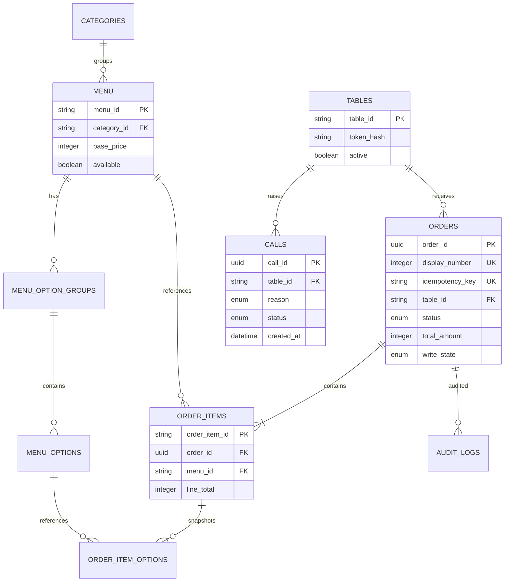

# Google Sheets 데이터 스키마

> 이 문서는 Sheet header, 타입, 제약, 관계와 운영 방식을 정의한다. API는 header 이름으로 열을 찾으며 열 번호를 하드코딩하지 않는다.

## 1. 공통 규칙

- Sheet 이름과 header는 이 문서의 대소문자 및 `snake_case`를 그대로 사용한다.
- 1행은 header, 2행부터 데이터다. 중간 빈 행과 병합 셀은 금지한다.
- ID는 문자열로 저장하고 숫자 자동 변환을 피하기 위해 열 서식을 Plain text로 지정한다.
- 금액은 원 단위 정수다. 소수점과 통화 기호를 셀 값에 넣지 않는다.
- boolean은 실제 Sheet boolean `TRUE/FALSE`를 쓴다.
- timestamp는 실제 Date 값으로 저장하고 표시 형식은 `yyyy-mm-dd hh:mm:ss`로 통일한다. Apps Script/API에서는 ISO 8601로 변환한다.
- 모든 API read는 `write_state=COMMITTED`인 주문만 반환한다.
- `unique`는 Sheets가 강제하지 못하므로 setup 검증과 Apps Script repository가 강제한다.
- canonical Sheet에 수식을 넣지 않는다. 수식은 `View_*` Sheet에만 둔다.
- `token_hash`, `request_fingerprint` 열은 보호한다. 원본 table token과 pepper는 Sheet에 저장하지 않는다.

## 2. Sheet 목록

| Sheet | 역할 | 주 변경 주체 |
|---|---|---|
| Tables | 테이블과 QR token hash | 개발자/총괄 운영진 |
| Categories | 메뉴 탭과 섹션 순서 | 운영진 |
| Menu | 메뉴 기본 정보와 판매 가능 상태 | 운영진 |
| MenuOptionGroups | 메뉴 옵션 선택 규칙 | 개발자/운영진 |
| MenuOptions | 옵션명, 가격 증감, 품절 | 운영진 |
| Orders | 주문 header, 상태, 결제, idempotency | Apps Script; 상태/결제만 운영진 |
| OrderItems | 주문 당시 메뉴 snapshot | Apps Script 전용 |
| OrderItemOptions | 주문 당시 선택 옵션 snapshot | Apps Script 전용 |
| Calls | 직원 호출 접수와 확인 | Apps Script; 확인만 운영진 |
| Settings | 행사 단위 설정과 순번 counter | 운영진; counter는 Apps Script |
| AuditLogs | 상태 변경과 오류 기록 | Apps Script 전용 |

Figma S04의 필수/복수 옵션 및 옵션별 품절을 표현하려면 MenuOptionGroups/MenuOptions가 필요하다. 과거 주문을 정확히 표시하려면 OrderItemOptions도 필요하다. Categories와 Settings는 운영진이 코드 수정 없이 탭/매장 정보를 관리하게 하는 최소 확장이다.

## 3. 관계



## 4. Tables

| column | type | 필수 | 예시 | unique | index처럼 사용 | 변경 주체 | 설명 |
|---|---|---:|---|---:|---:|---|---|
| `table_id` | string | Y | `T12` | Y | Y | 개발자 | API와 QR의 안정적인 식별자 |
| `display_name` | string | Y | `테이블 12` | N | N | 운영진 | Figma TableChip 표시값 |
| `token_hash` | hex string | Y | `9f3a...` | Y | Y | setup/token rotate 함수 | `SHA-256(pepper + ":" + rawToken)` |
| `token_version` | integer | Y | `1` | N | N | token rotate 함수 | QR 교체/폐기 추적 |
| `active` | boolean | Y | `TRUE` | N | Y | 운영진 | FALSE면 신규 접근/주문 차단 |
| `sort_order` | integer | Y | `12` | N | N | 운영진 | 운영 화면 정렬 |
| `created_at` | datetime | Y | `2026-08-25 15:00:00` | N | N | Apps Script | 생성 시각 |
| `updated_at` | datetime | Y | `2026-08-25 18:30:00` | N | N | Apps Script | 마지막 변경 시각 |

인덱스 map: `byTableId`, `byTokenHash`. `table_id`와 `token_hash`는 각각 중복 불가다.

Sample:

| table_id | display_name | token_hash | token_version | active | sort_order | created_at | updated_at |
|---|---|---|---:|---|---:|---|---|
| T12 | 테이블 12 | `9f3a…` | 1 | TRUE | 12 | 2026-08-25 15:00:00 | 2026-08-25 15:00:00 |

## 5. Categories

| column | type | 필수 | 예시 | unique | index | 변경 주체 | 설명 |
|---|---|---:|---|---:|---:|---|---|
| `category_id` | string | Y | `recommended` | Y | Y | 개발자/운영진 | API category id |
| `label` | string | Y | `추천` | N | N | 운영진 | Figma 탭 레이블 |
| `heading` | string | Y | `추천 메뉴` | N | N | 운영진 | 목록 섹션 제목 |
| `sort_order` | integer | Y | `10` | N | Y | 운영진 | 오름차순 정렬 |
| `active` | boolean | Y | `TRUE` | N | Y | 운영진 | 비활성 category와 소속 메뉴는 API에서 제외 |
| `updated_at` | datetime | Y | `2026-08-25 15:00:00` | N | N | Apps Script/운영진 | 변경 시각 |

초기 seed는 행사 메뉴 구분에 맞춰 `main`, `side`, `alcohol`, `beverage`를 사용한다.

## 6. Menu

| column | type | 필수 | 예시 | unique | index | 변경 주체 | 설명 |
|---|---|---:|---|---:|---:|---|---|
| `menu_id` | string | Y | `kimchi-jjigae` | Y | Y | 개발자 | 메뉴 불변 ID |
| `category_id` | string FK | Y | `recommended` | N | Y | 운영진 | Categories 참조 |
| `name` | string | Y | `김치찌개` | N | N | 운영진 | 표시명 |
| `description` | string | Y | `돼지고기와 묵은지를...` | N | N | 운영진 | 목록/상세 설명 |
| `base_price` | integer >= 0 | Y | `9000` | N | N | 운영진 | 옵션 전 기본 가격 |
| `image_url` | URL/string | N | `https://.../kimchi.jpg` | N | N | 운영진 | 빈 값이면 placeholder |
| `available` | boolean | Y | `TRUE` | N | Y | 운영진 | FALSE면 품절. 목록에는 반환하되 주문 차단 |
| `min_quantity` | integer >= 1 | Y | `1` | N | N | 운영진 | 한 주문 line의 최소 수량 |
| `max_quantity` | integer >= min | Y | `10` | N | N | 운영진 | line별 최대 수량 |
| `allergens` | string | N | `대두|밀` | N | N | 운영진 | `|`로 구분, API는 배열로 변환 |
| `origin` | string | N | `국내산` | N | N | 운영진 | 원산지 표시 |
| `badge_tags` | string | N | `인기|매움` | N | N | 운영진 | 향후 tag badge용. Figma 현재 화면에는 필수 아님 |
| `sort_order` | integer | Y | `10` | N | Y | 운영진 | category 안 정렬 |
| `updated_at` | datetime | Y | `2026-08-25 18:10:00` | N | N | Apps Script/운영진 | 변경 시각 |

무결성:

- `category_id`가 존재하고 활성 상태여야 API에 노출된다.
- `base_price`, `min_quantity`, `max_quantity`가 숫자가 아니면 해당 메뉴를 API에서 제외하고 AuditLog를 남긴다.
- 이미 주문된 메뉴 행을 삭제하지 않는다. 더 이상 판매하지 않으면 `available=FALSE`로 둔다.
- `menu_id`는 이름 변경과 무관하게 유지한다.

Sample:

| menu_id | category_id | name | description | base_price | image_url | available | min_quantity | max_quantity | allergens | origin | badge_tags | sort_order | updated_at |
|---|---|---|---|---:|---|---|---:|---:|---|---|---|---:|---|
| kimchi-jjigae | recommended | 김치찌개 | 돼지고기와 묵은지를 넣고 진하게 끓여낸 대표 메뉴입니다 | 9000 |  | TRUE | 1 | 10 | 대두\|밀 | 국내산 |  | 10 | 2026-08-25 15:00:00 |
| haemul-pajeon | recommended | 해물파전 | 오징어와 새우를 넉넉히 올린 바삭한 파전 | 15000 |  | FALSE | 1 | 10 | 밀\|갑각류 | 수입산 |  | 30 | 2026-08-25 18:10:00 |

## 7. MenuOptionGroups

| column | type | 필수 | 예시 | unique | index | 변경 주체 | 설명 |
|---|---|---:|---|---:|---:|---|---|
| `option_group_id` | string | Y | `kimchi-spiciness` | Y | Y | 개발자 | 전역 고유 그룹 ID |
| `menu_id` | string FK | Y | `kimchi-jjigae` | N | Y | 개발자 | 소속 메뉴 |
| `label` | string | Y | `맵기 선택` | N | N | 운영진 | Figma 그룹명 |
| `selection_type` | enum | Y | `SINGLE` | N | N | 개발자 | `SINGLE` 또는 `MULTIPLE` |
| `required` | boolean | Y | `TRUE` | N | N | 운영진 | 필수 badge 및 validation |
| `min_select` | integer >= 0 | Y | `1` | N | N | 개발자 | 최소 선택 수 |
| `max_select` | integer >= min | Y | `1` | N | N | 개발자 | 최대 선택 수 |
| `sort_order` | integer | Y | `10` | N | Y | 운영진 | 필수 그룹을 먼저 정렬한 뒤 이 값 사용 |
| `active` | boolean | Y | `TRUE` | N | Y | 운영진 | FALSE면 신규 주문에서 제외 |
| `updated_at` | datetime | Y | `2026-08-25 15:00:00` | N | N | Apps Script/운영진 | 변경 시각 |

enum과 validation:

- `selection_type=SINGLE`이면 `max_select=1`이다.
- `required=TRUE`이면 `min_select>=1`이다.
- `required=FALSE`인 single/check 그룹은 `min_select=0`이 가능하다.
- active 그룹에 active option이 하나도 없으면 catalog 오류다. required 그룹이면 해당 메뉴는 주문 불가로 취급한다.

## 8. MenuOptions

| column | type | 필수 | 예시 | unique | index | 변경 주체 | 설명 |
|---|---|---:|---|---:|---:|---|---|
| `option_id` | string | Y | `kimchi-normal` | Y | Y | 개발자 | 전역 고유 옵션 ID |
| `option_group_id` | string FK | Y | `kimchi-spiciness` | N | Y | 개발자 | MenuOptionGroups 참조 |
| `menu_id` | string FK | Y | `kimchi-jjigae` | N | Y | 개발자 | 조회 최적화용 중복 FK; 그룹의 menu_id와 일치해야 함 |
| `name` | string | Y | `보통` | N | N | 운영진 | 옵션 표시명 |
| `price_delta` | integer | Y | `0` | N | N | 운영진 | 음수도 허용하되 최종 단가는 0 이상이어야 함 |
| `available` | boolean | Y | `TRUE` | N | Y | 운영진 | 옵션 품절 여부 |
| `default_selected` | boolean | Y | `TRUE` | N | N | 운영진 | 상세 진입 시 기본 선택. 서버 검증에는 영향 없음 |
| `sort_order` | integer | Y | `10` | N | Y | 운영진 | 그룹 안 정렬 |
| `updated_at` | datetime | Y | `2026-08-25 15:00:00` | N | N | Apps Script/운영진 | 변경 시각 |

Sample:

| option_id | option_group_id | menu_id | name | price_delta | available | default_selected | sort_order | updated_at |
|---|---|---|---|---:|---|---|---:|---|
| kimchi-normal | kimchi-spiciness | kimchi-jjigae | 보통 | 0 | TRUE | TRUE | 10 | 2026-08-25 15:00:00 |
| kimchi-rice | kimchi-extras | kimchi-jjigae | 공기밥 추가 | 1000 | TRUE | FALSE | 10 | 2026-08-25 15:00:00 |
| kimchi-egg | kimchi-extras | kimchi-jjigae | 계란후라이 | 2000 | FALSE | FALSE | 20 | 2026-08-25 18:05:00 |

## 9. Orders

고정 열 순서는 운영 View 수식의 기준이 된다.

| col | column | type | 필수 | 예시 | unique | index | 변경 주체 | 설명 |
|---:|---|---|---:|---|---:|---:|---|---|
| A | `order_id` | UUID string | Y | `d08c...` | Y | Y | Apps Script | 내부 PK |
| B | `display_number` | integer | Y | `1042` | Y | Y | Apps Script | 현장 순번 |
| C | `display_code` | string | Y | `A-1042` | Y | Y | Apps Script | Figma/고객 표시값 |
| D | `client_request_id` | UUID string | Y | `8eaf...` | N | Y | frontend → server | idempotency 원본 |
| E | `idempotency_key` | string | Y | `T12:8eaf...` | Y | Y | Apps Script | `(table_id, client_request_id)` |
| F | `request_fingerprint` | hex string | Y | `a18c...` | N | N | Apps Script | 동일 key의 다른 payload 감지 |
| G | `table_id` | string FK | Y | `T12` | N | Y | Apps Script | Tables 참조 |
| H | `status` | enum | Y | `RECEIVED` | N | Y | Apps Script/운영진 | 주문 상태 |
| I | `public_status` | enum | Y | `accepted` | N | N | Apps Script | status에서 파생해 저장; UI 계약 안정화 |
| J | `payment_status` | enum | Y | `UNPAID` | N | Y | 운영진 | 후불 결제 상태 |
| K | `total_amount` | integer >= 0 | Y | `23000` | N | N | Apps Script | 서버 계산 주문 총액 |
| L | `note` | string <= 200 | N | `덜 맵게 부탁드려요` | N | N | frontend → server | 주방 요청. 현재 Figma에는 미표시 |
| M | `write_payload_json` | JSON string | Y | `[{"lineNo":1,...}]` | N | N | Apps Script | token을 제외한 서버 검증 snapshot. 부분 write 복구용, 보호 열 |
| N | `write_state` | enum | Y | `COMMITTED` | N | Y | Apps Script | `WRITING/COMMITTED/FAILED` |
| O | `status_updated_at` | datetime | Y | `2026-08-25 19:24:00` | N | Y | Apps Script/trigger | 상태 변경 시각 |
| P | `created_at` | datetime | Y | `2026-08-25 19:24:00` | N | Y | Apps Script | 주문 접수 시각 |
| Q | `updated_at` | datetime | Y | `2026-08-25 19:30:00` | N | Y | Apps Script/trigger | 마지막 변경 |
| R | `paid_at` | datetime | N | `2026-08-25 21:10:00` | N | N | 운영진/trigger | 결제 완료 시각 |
| S | `cancelled_at` | datetime | N |  | N | N | trigger | 취소 시각 |
| T | `cancel_reason` | string | N | `재료 소진` | N | N | 운영진 | CANCELLED이면 권장 필수 |

enum:

- `status`: `RECEIVED`, `CONFIRMED`, `PREPARING`, `SERVING`, `COMPLETED`, `CANCELLED`
- `public_status`: `accepted`, `preparing`, `served`, `closed`, `cancelled`
- `payment_status`: `UNPAID`, `PAID`, `WAIVED`, `REFUNDED`
- `write_state`: `WRITING`, `COMMITTED`, `FAILED`

상태 mapping은 다음과 같이 고정한다.

```text
RECEIVED | CONFIRMED -> accepted
PREPARING            -> preparing
SERVING              -> served
COMPLETED            -> closed
CANCELLED            -> cancelled
```

Sample:

| order_id | display_number | display_code | client_request_id | idempotency_key | request_fingerprint | table_id | status | public_status | payment_status | total_amount | note | write_payload_json | write_state | status_updated_at | created_at | updated_at | paid_at | cancelled_at | cancel_reason |
|---|---:|---|---|---|---|---|---|---|---|---:|---|---|---|---|---|---|---|---|---|
| d08c… | 1042 | A-1042 | 8eaf… | T12:8eaf… | a18c… | T12 | RECEIVED | accepted | UNPAID | 23000 |  | `[{"lineNo":1,...}]` | COMMITTED | 2026-08-25 19:24:00 | 2026-08-25 19:24:00 | 2026-08-25 19:24:00 |  |  |  |

## 10. OrderItems

| column | type | 필수 | 예시 | unique | index | 변경 주체 | 설명 |
|---|---|---:|---|---:|---:|---|---|
| `order_item_id` | string | Y | `d08c...-01` | Y | Y | Apps Script | `{order_id}-{2-digit line_no}` deterministic ID |
| `order_id` | UUID FK | Y | `d08c...` | N | Y | Apps Script | Orders 참조 |
| `line_no` | integer >= 1 | Y | `1` | `(order_id,line_no)` | N | Apps Script | 원 요청의 행 순서 |
| `menu_id` | string FK | Y | `kimchi-jjigae` | N | Y | Apps Script | 원본 메뉴 추적용 |
| `menu_name_snapshot` | string | Y | `김치찌개` | N | N | Apps Script | 주문 시점 이름 |
| `base_price_snapshot` | integer | Y | `9000` | N | N | Apps Script | 옵션 전 가격 |
| `unit_price_snapshot` | integer | Y | `10000` | N | N | Apps Script | 선택 옵션을 포함한 1개 가격 |
| `quantity` | integer | Y | `1` | N | N | Apps Script | 서버 검증 수량 |
| `line_total` | integer | Y | `10000` | N | N | Apps Script | `unit_price_snapshot * quantity` |
| `created_at` | datetime | Y | `2026-08-25 19:24:00` | N | N | Apps Script | 기록 시각 |

OrderItems에는 현재 Menu 이름/가격을 수식으로 참조하지 않는다. 모든 표시와 통계는 snapshot 열을 사용한다.

## 11. OrderItemOptions

| column | type | 필수 | 예시 | unique | index | 변경 주체 | 설명 |
|---|---|---:|---|---:|---:|---|---|
| `order_item_option_id` | string | Y | `d08c...-01-01` | Y | Y | Apps Script | deterministic child ID |
| `order_item_id` | string FK | Y | `d08c...-01` | N | Y | Apps Script | OrderItems 참조 |
| `order_id` | UUID FK | Y | `d08c...` | N | Y | Apps Script | 회차 조회 최적화용 중복 FK |
| `option_id` | string FK | Y | `kimchi-rice` | N | Y | Apps Script | 원본 옵션 추적 |
| `option_group_name_snapshot` | string | Y | `추가 선택` | N | N | Apps Script | 주문 시점 그룹명 |
| `option_name_snapshot` | string | Y | `공기밥 추가` | N | N | Apps Script | 주문 시점 옵션명 |
| `price_delta_snapshot` | integer | Y | `1000` | N | N | Apps Script | 1개당 가격 증감 |
| `sort_order` | integer | Y | `1` | N | N | Apps Script | 표시 순서 |
| `created_at` | datetime | Y | `2026-08-25 19:24:00` | N | N | Apps Script | 기록 시각 |

같은 옵션 ID를 한 item 안에서 두 번 선택할 수 없다. 옵션 가격은 수량에 따라 `price_delta_snapshot * quantity`로 적용되며 `unit_price_snapshot`에도 이미 포함된다.

## 12. Settings

| column | type | 필수 | 예시 | unique | index | 변경 주체 | 설명 |
|---|---|---:|---|---:|---:|---|---|
| `key` | string | Y | `STORE_NAME` | Y | Y | 개발자 | 설정 키 |
| `value` | string | Y | `행복식당 본점` | N | N | 운영진/Apps Script | type에 따라 parse |
| `type` | enum | Y | `STRING` | N | N | 개발자 | `STRING/INTEGER/BOOLEAN` |
| `description` | string | Y | `S01 매장명` | N | N | 개발자 | 운영 설명 |
| `updated_at` | datetime | Y | `2026-08-25 15:00:00` | N | N | Apps Script/운영진 | 변경 시각 |

필수 초기 설정:

| key | value 예시 | type | 수정 주체 | 용도 |
|---|---|---|---|---|
| `EVENT_ID` | `2026-fall-pub` | STRING | 개발자 | 로그/캐시 namespace |
| `STORE_NAME` | `행복식당 본점` | STRING | 운영진 | S01 표시 |
| `FRONTEND_BASE_URL` | `https://caucse.shop` | STRING | 개발자 | QR URL을 만드는 Netlify production origin |
| `EVENT_OPEN` | `TRUE` | BOOLEAN | 운영진 | 전체 신규 접근/주문 on/off |
| `NOTICE` | `주문은 이 테이블로...` | STRING | 운영진 | S01 안내 |
| `ORDER_PREFIX` | `A-` | STRING | 운영진 | display code 접두사 |
| `NEXT_DISPLAY_NUMBER` | `1042` | INTEGER | Apps Script | Lock 안에서 읽고 +1 |
| `MAX_ORDER_LINES` | `20` | INTEGER | 개발자 | payload abuse 방지 |
| `DEFAULT_MAX_QUANTITY` | `10` | INTEGER | 개발자 | 메뉴 값 누락 시 fail-safe 참조 |
| `TIME_ZONE` | `Asia/Seoul` | STRING | 개발자 | 표시 시각 |
| `STATUS_POLL_SECONDS` | `15` | INTEGER | 개발자 | 프론트 기본 polling 주기 |
| `CALL_MIN_INTERVAL_SECONDS` | `60` | INTEGER | 운영진 | 같은 테이블의 연속 직원 호출 최소 간격 |

`TOKEN_PEPPER`, Spreadsheet ID처럼 비공개/배포 설정인 값은 Settings가 아니라 Script Properties에 저장한다.

## 13. AuditLogs

| column | type | 필수 | 예시 | unique | index | 변경 주체 | 설명 |
|---|---|---:|---|---:|---:|---|---|
| `log_id` | UUID | Y | `a7bf...` | Y | Y | Apps Script | PK |
| `occurred_at` | datetime | Y | `2026-08-25 19:30:00` | N | Y | Apps Script | 사건 시각 |
| `actor_type` | enum | Y | `STAFF` | N | Y | Apps Script | `SYSTEM/STAFF/CLIENT` |
| `actor_id` | string | N | `student-council@example.com` | N | N | trigger | 식별 가능할 때만. 단순 trigger에서는 비어 있을 수 있음 |
| `action` | string enum-like | Y | `ORDER_STATUS_CHANGED` | N | Y | Apps Script | 사건 종류 |
| `entity_type` | string | Y | `ORDER` | N | Y | Apps Script | 대상 종류 |
| `entity_id` | string | Y | `d08c...` | N | Y | Apps Script | 대상 ID |
| `from_value` | string | N | `CONFIRMED` | N | N | Apps Script | 이전 값 |
| `to_value` | string | N | `PREPARING` | N | N | Apps Script | 새 값 |
| `request_id` | string | N | `8eaf...` | N | Y | Apps Script | clientRequestId/추적 ID |
| `detail_json` | string JSON | N | `{"reason":"..."}` | N | N | Apps Script | 민감 토큰/stack trace는 저장 금지 |

권장 `action`: `ORDER_CREATED`, `ORDER_REPLAYED`, `ORDER_WRITE_FAILED`, `ORDER_WRITE_RECOVERED`, `ORDER_STATUS_CHANGED`, `INVALID_STATUS_EDIT`, `PAYMENT_STATUS_CHANGED`, `TABLE_TOKEN_ROTATED`, `CATALOG_INVALID`, `CALL_CREATED`, `CALL_ACKNOWLEDGED`, `CALL_CANCELLED`, `CALL_THROTTLED`.

호출 확인은 여러 행을 한 번에 바꾸므로 `CALL_ACKNOWLEDGED`는 그룹 단위로 1건만 기록하고, `entity_type=TABLE`, `entity_id=table_id`, `detail_json`에 `{"callIds":[...],"count":2}`를 담는다. 행마다 로그를 남기면 병합의 의미가 사라진다.

## 14. Calls

고객 S09 `직원 호출`의 접수 단위다. 주문과 생명주기가 다르므로 Orders에 열을 붙이지 않고 별도 Sheet로 둔다. 주문이 없는 테이블도 호출할 수 있고, 한 테이블이 한 세션에 여러 번 호출할 수 있다.

| column | type | 필수 | 예시 | unique | index | 변경 주체 | 설명 |
|---|---|---:|---|---:|---:|---|---|
| `call_id` | UUID | Y | `c41e...` | Y | Y | Apps Script | PK |
| `table_id` | string | Y | `T12` | N | Y | Apps Script | Tables FK |
| `reason` | enum | Y | `WATER_UTENSIL` | N | N | Apps Script | 고객이 S09에서 고른 사유 |
| `status` | enum | Y | `PENDING` | N | Y | Apps Script/운영진 | 호출 처리 상태 |
| `client_request_id` | string | N | `7c2a...` | Y | Y | Apps Script | 재전송 방지. 동일 값 재요청은 정상 성공 |
| `created_at` | datetime | Y | `2026-08-25 19:24:00` | N | Y | Apps Script | 호출 시각. **병합 그룹의 경과 시간 기준** |
| `acknowledged_at` | datetime | N | `2026-08-25 19:28:00` | N | N | Apps Script | 확인 시각 |
| `acknowledged_by` | string | N | `staff-03` | N | N | Apps Script | 식별 가능할 때만 |
| `cancelled_at` | datetime | N | `2026-08-25 19:26:00` | N | N | Apps Script | 고객이 S09b에서 호출 취소한 시각 |
| `updated_at` | datetime | Y | `2026-08-25 19:28:00` | N | N | Apps Script | 마지막 변경 시각 |

enum:

- `reason`: `WATER_UTENSIL`, `SIDE_PLATE`, `ORDER_INQUIRY`, `PAYMENT_REQUEST`, `OTHER`
- `status`: `PENDING`, `ACKNOWLEDGED`, `CANCELLED`

인덱스 map: `byTableId`(status=`PENDING`만), `byClientRequestId`.

### 중복 호출 병합

운영 화면(A01 호출 스트립)은 호출 행을 그대로 나열하지 않는다. 같은 테이블의 호출은 한 행으로 묶어 보여준다.

- **병합 단위**: `(table_id, status='PENDING')`
- **횟수**: 그룹의 행 수
- **경과 시간**: 그룹의 `MIN(created_at)`. 손님이 실제로 기다린 시간이므로 최신 호출이 아니라 최초 호출을 쓴다
- **사유**: 그룹 내 `reason`을 `created_at` 오름차순으로 중복 제거해 나열
- **확인**: 그 테이블의 `PENDING` 행 **전부**를 한 번에 `ACKNOWLEDGED`로 바꾸고 동일한 `acknowledged_at`을 기록
- **정렬**: 그룹의 `MIN(created_at)` 오름차순. 오래 기다린 테이블이 위로 온다

### 확인 이후 재호출은 카운트를 리셋한다

확인이 그 테이블의 `PENDING` 행을 모두 비우므로, 이후 새 호출은 **자동으로 1회짜리 새 그룹**이 된다.

- `repeat_count` 같은 파생 컬럼을 두지 않는다. 그룹 조건 자체가 리셋을 만들기 때문에 리셋 로직도, 값이 어긋날 여지도 없다. 이는 §1의 "canonical Sheet에 수식/파생값을 넣지 않는다"와 같은 원칙이다.
- 리셋이 맞는 이유: 직원이 다녀온 뒤의 대기 시간이 실제 긴급도다. 누적하면 이미 해결된 대기가 긴급도에 계속 섞인다.
- 확인 직후의 재호출은 오히려 더 급한 신호다(다녀왔는데 또 불렀다). 카운트는 1이지만 `created_at`이 최신이라 정렬 위치는 낮아지므로, 운영 화면에서는 이 경우를 `acknowledged_at`이 있는 직전 그룹과 함께 읽어야 한다. 자동 상향 조정은 하지 않는다.

### 호출 빈도 제한

병합은 표시 문제를 풀지 저장 문제를 풀지는 않는다. 한 탭이 계속 호출하면 Calls 행이 무한히 늘어난다.

- 같은 `table_id`의 마지막 `created_at`으로부터 `CALL_MIN_INTERVAL_SECONDS` 이내의 신규 호출은 거절한다(`CALL_TOO_FREQUENT`).
- 이 값은 병합 규칙과 독립이다. 간격을 지킨 3회 호출은 정상적으로 3회로 묶인다.

Sample:

| call_id | table_id | reason | status | client_request_id | created_at | acknowledged_at | cancelled_at | updated_at |
|---|---|---|---|---|---|---|---|---|
| c41e… | T12 | WATER_UTENSIL | ACKNOWLEDGED | 7c2a… | 2026-08-25 19:20:00 | 2026-08-25 19:28:00 | | 2026-08-25 19:28:00 |
| d90b… | T12 | SIDE_PLATE | ACKNOWLEDGED | 8f11… | 2026-08-25 19:24:00 | 2026-08-25 19:28:00 | | 2026-08-25 19:28:00 |
| e02c… | T12 | PAYMENT_REQUEST | PENDING | 9a37… | 2026-08-25 19:41:00 | | | 2026-08-25 19:41:00 |

위 예시에서 19:28 확인 시점의 표시는 `T12 · 2회 · 19:20 첫 호출`이었고, 19:41 재호출은 리셋되어 `T12 · 1회 · 19:41 호출`로 표시된다.

## 15. repository 인덱스와 조회 규칙

Google Sheets에는 index가 없다. 한 API 실행에서 필요한 범위를 한 번씩 `getValues()`로 읽고 JavaScript Map을 만든다.

| 목적 | Map/그룹 키 |
|---|---|
| 테이블 인증 | Tables `table_id`, `token_hash` |
| 카테고리 조립 | Categories `category_id` |
| 메뉴 조회 | Menu `menu_id`, `category_id`별 배열 |
| 옵션 조립 | MenuOptionGroups `menu_id`; MenuOptions `option_group_id`, `option_id` |
| idempotency | Orders `idempotency_key` |
| 단일 주문 | Orders `order_id` 또는 `display_code` |
| 테이블 주문 | Orders `table_id`, created_at 내림차순 |
| 주문 항목 | OrderItems `order_id` |
| 선택 옵션 | OrderItemOptions `order_item_id` |
| 미확인 호출 병합 | Calls `status='PENDING'`을 `table_id`로 group, 그룹별 `MIN(created_at)` 오름차순 |

Orders가 수천 행을 넘기 시작하면 당일 Sheet만 활성 데이터로 두고 과거 행사는 별도 파일로 archive한다. 행마다 `getRange().getValue()`를 반복하지 않는다.

## 16. 운영 View와 통계

View Sheet는 선택 사항이며 canonical 데이터가 아니다. 다음 수식은 Orders 열 순서 A:T를 기준으로 한다.

### 상태별 View

`View_AllOrders!A1`

```gs
=QUERY(Orders!A:T,"select * where N = 'COMMITTED' order by P desc",1)
```

`View_Kitchen!A1`

```gs
=QUERY(Orders!A:T,"select * where N = 'COMMITTED' and (H = 'CONFIRMED' or H = 'PREPARING') order by P asc",1)
```

`View_Serving!A1`

```gs
=QUERY(Orders!A:T,"select * where N = 'COMMITTED' and H = 'SERVING' order by O asc",1)
```

`View_Payment!A1`

```gs
=QUERY(Orders!A:T,"select * where N = 'COMMITTED' and J = 'UNPAID' and H <> 'CANCELLED' order by G asc, P asc",1)
```

`View_Completed!A1`

```gs
=QUERY(Orders!A:T,"select * where N = 'COMMITTED' and H = 'COMPLETED' order by Q desc",1)
```

`View_WriteFailures!A1`

```gs
=QUERY(Orders!A:T,"select * where N <> 'COMMITTED' order by P asc",1)
```

`View_Calls!A1` — Calls 열 순서 A:J 기준

```gs
=QUERY(Calls!A:J,"select B, C, F where D = 'PENDING' order by F asc",1)
```

이 View는 병합 전 원본 행이다. 같은 `table_id`가 여러 줄로 보이는 것이 정상이며, 묶어서 보여주는 것은 운영 화면의 책임이다. Sheet 수식으로 group 집계를 만들지 않는다.

운영진이 View Sheet를 수정하면 안 된다. 상태 변경은 Orders 원본의 `status` dropdown 또는 Apps Script 커스텀 메뉴에서 수행한다. 호출 확인도 같은 이유로 Sheet 직접 편집이 아니라 커스텀 메뉴/운영 화면에서 수행한다 — 한 테이블의 `PENDING` 행을 전부 함께 바꿔야 하기 때문이다.

### 통계 예시

총매출은 취소되지 않고 결제 완료된 주문을 기준으로 한다.

```gs
=SUM(FILTER(Orders!K2:K, Orders!N2:N="COMMITTED", Orders!J2:J="PAID", Orders!H2:H<>"CANCELLED"))
```

메뉴별 판매량/매출은 snapshot으로 계산한다.

```gs
=QUERY(OrderItems!A:J,"select E, sum(H), sum(I) where E is not null group by E label sum(H) '판매수량', sum(I) '매출'",1)
```

테이블별 주문 금액:

```gs
=QUERY(Orders!A:T,"select G, sum(K) where N = 'COMMITTED' and H <> 'CANCELLED' group by G label sum(K) '주문금액'",1)
```

시간대별 주문량은 helper View에서 `=HOUR(Orders!P2)`를 만든 뒤 QUERY로 집계하거나 Pivot Table을 권장한다. 취소 주문은 `status=CANCELLED`, `write_state=COMMITTED` Filter View로 확인한다.

## 17. 무결성 체크리스트

setup 또는 행사 전 진단 함수는 다음을 모두 검사하고 오류가 있으면 주문 오픈을 막는다.

- 필수 Sheet/header가 정확히 존재하는가
- 모든 PK/unique 값이 비어 있지 않고 중복되지 않는가
- 모든 FK가 존재하는가
- numeric/boolean/date 타입이 올바른가
- active required option group에 주문 가능한 option이 충분한가
- SINGLE 그룹의 min/max가 유효한가
- default option 수가 max를 넘지 않는가
- `NEXT_DISPLAY_NUMBER`가 기존 최대 display number보다 큰가
- Orders의 `total_amount`가 OrderItems `line_total` 합과 일치하는가
- OrderItems `line_total = unit_price_snapshot * quantity`인가
- OrderItems의 base + option delta 합이 unit snapshot과 일치하는가
- terminal status의 timestamp와 cancel reason 정책이 충족되는가
- Calls의 `status=ACKNOWLEDGED`인 행에 `acknowledged_at`이 모두 있는가
- Calls의 `status=CANCELLED`인 행에 `cancelled_at`이 모두 있는가
- Calls의 `status=PENDING`인 행에 `acknowledged_at`/`cancelled_at`이 비어 있는가
- 같은 `table_id`의 `ACKNOWLEDGED` 그룹이 동일한 `acknowledged_at`을 공유하는가 (확인은 그룹 단위 1회 동작이다)
