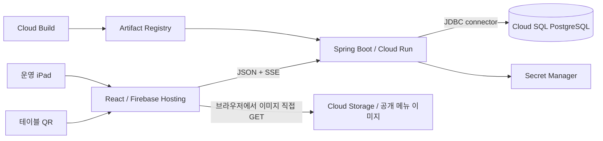

# Spring Boot + GCP 운영 아키텍처

## 구성



- 고객과 운영 앱은 하나의 `VITE_API_BASE_URL`을 사용한다.
- 메뉴 API의 기존 `imageUrl`은 공개 Cloud Storage 객체를 가리킨다. 이미지 업로드·캐시·URL 연결은
  [메뉴 이미지 운영 가이드](./menu-images.md)를 따른다. Cloud Run을 통한 이미지 중계는 하지 않는다.
- 고객은 QR의 table token, 운영 앱은 공용 passcode로 발급받은 bearer token으로 인증한다.
- Cloud Run은 서울 리전에서 최소 1개, 최대 3개 인스턴스를 사용한다.
- Cloud SQL은 단일 존 PostgreSQL 17, 자동 백업과 PITR을 사용한다.

## 데이터와 실시간 갱신

- Flyway가 관계형 스키마와 seed catalog를 생성한다.
- 주문 생성, 결제, 합석·분리·이동은 PostgreSQL transaction과 행 잠금으로 처리한다.
- 모든 변경은 같은 transaction에서 `domain_events`를 기록하고 `pg_notify`를 호출한다.
- 각 Cloud Run 인스턴스는 `LISTEN qr_order_events` 전용 연결로 이벤트를 받아 로컬 SSE 연결에 fan-out한다.
- SSE payload는 변경 알림만 전달한다. 프런트는 수신 즉시 해당 snapshot API를 다시 호출한다.
- 20초 heartbeat, 25분 재연결, `Last-Event-ID` replay와 60초 정합성 조회를 사용한다. 연결 실패 중에는 기존 polling이 계속 동작한다.

## 합석 주문내역 조회 정책 (2026-09-14 확정)

테이블 합석 시 같은 그룹의 현재 방문 주문내역을 공유한다. 고객은 그룹 내 어느 테이블의
QR로 접속해도 전체 주문내역을 조회하며, 스태프 테이블 상세도 같은 범위를 사용한다.
주문 자체의 테이블·세션 귀속은 유지하고, 분리 시 조회 범위를 각 세션으로 되돌린다.
합석·분리 및 그룹 내 주문 변경은 관련 고객·스태프 화면의 재조회를 유도해야 한다.

상세 범위와 검증 예시는 [스태프 POS 정책 §3.7](./staff-pos-design.md#37-a05--a06--합석-테이블-주문내역-공유)을
따른다. Spring Boot 및 프런트 구현과 검증 결과는 [구현 기록](../../qr-order-frontend/docs/pr/codex-hanshin-floor-plan-shared-orders.md)에 정리했다.

## 전환 원칙

- 과거 주문·호출·세션은 이전하지 않는다.
- 기존 QR을 유지하기 위해 `Tables`의 ID, 표시명, token hash와 기존 `TOKEN_PEPPER`만 가져온다.
- import는 거래 데이터가 하나라도 생기면 서버가 거부한다.
- 행사 시작 후 장애 롤백은 이전 Cloud Run revision으로만 한다. Apps Script로 쓰기를 되돌리지 않는다.

## 검증

```bash
cd qr-order-backend && ./gradlew test
cd ../qr-order-frontend && npm ci && npm run test && npm run lint && npm run build
```

staging 부하는 `load-tests/sse-connections.mjs`로 100개 스트림을 유지한
상태에서 `load-tests/sse-and-orders.js`의 조회·주문 혼합 시나리오를 실행한다.

인프라와 secret 순서는 [infra/README.md](../../infra/README.md)를 따른다.
